# Batalla Naval en terminal (Java + Lanterna)

Proyecto final **1MD** de Ismael y Yamandú. Juego de Batalla Naval.

## Contenido

1. [Estructura del proyecto](#estructura-del-proyecto)
2. [Controles](#controles)
3. [Arquitectura y flujo general](#arquitectura-y-flujo-general)
4. [Estados de las celdas](#estados-de-las-celdas)
5. [Glosario de variables globales](#glosario-de-variables-globales)
6. [Glosario de funciones](#glosario-de-funciones)
7. [Estructuras de datos](#estructuras-de-datos)
8. [Diagramas de flujo por función](#diagramas-de-flujo-por-función)

## Estructura del proyecto

```text
1MD-PtoyectoFinal/
├── lib/
│   └── lanterna-3.1.2.jar
├── src/
│   ├── Main.java            # Archivo principal
│   └── modules/
│       ├── Game.java        # Lógica del juego
│       ├── Menu.java        # Menús 
│       ├── Bot.java         # Bot
│       ├── Display.java     # Utilidades 
│       └── Texts.java       # Textos 
└── .gitignore
```

| Archivo | Rol |
|---|---|
| `Main.java` | Crea la pantalla, muestra el menú y lanza el juego. |
| `modules/Menu.java` | Menús de configuración (usuario, tamaño, dificultad, velocidad) y menú final. |
| `modules/Game.java` | Lógica del juego. Contiene además las clases auxiliares `Board`, `Boat` y `Player`. |
| `modules/Bot.java` | Decide los disparos del rival según la dificultad. |
| `modules/Display.java` | Define las utilidades de dibujado. |
| `modules/Texts.java` | Todos los textos y el arte ASCII. |

## Arquitectura y flujo general

`Main.main` → `Menu.show` (configuración) → `Game.game_loop` (coloca barcos) → `Game.game` (turnos) → `Menu.menu_end` → volver / guardar / salir.

## Estados de las celdas

El tablero es una matriz `int[][]` y cada celda guarda un número. Se accede como `board[x][y]`, donde **x = columna** e **y = fila**.

| Valor | Significado | Cómo se dibuja |
|---|---|---|
| `0` | Agua sin disparar | `■` azul |
| `1` | Barco intacto | `■` rojo  |
| `2` | Barco impactado (acierto) | `x` roja |
| `3` | Disparo fallado (agua) | `0` blanco |

## Glosario de variables globales

### Clase `Game`

| Variable | Tipo | Valor inicial | Qué hace |
|---|---|---|---|
| `size_board` | `int` | 12 | Lado del tablero (cuadrado N×N) (12 a 25). |
| `boat_quantity` | `int` | 0 | Cantidad de barcos por jugador. El menú la fija como `size_board / 2`. |
| `dificult` | `int` | 0 | Dificultad: 0 Fácil, 1 Medio, 2 Difícil, 3 Imposible. La usa `Bot`. |
| `velocity` | `int` | 1 | Multiplicador de velocidad de animaciones (x1 a x4). |
| `sleep_time` | `int` | 750 | Milisegundos de pausa entre mensajes. |
| `plays` | `int` | 0 | Total de disparos del jugador. |
| `acerted` | `int` | 0 | Disparos acertados del jugador. |
| `missed` | `int` | 0 | Disparos fallados del jugador. |

### Clase `Menu`

| Variable | Tipo | Qué hace |
|---|---|---|
| `box_style` | `char[]` | Caracteres del marco: `{┌, ┐, └, ┘, ─, │}` (esquina sup-izq, sup-der, inf-izq, inf-der, horizontal, vertical). |
| `box_width` | `int` = 60 | Ancho del marco de los menús. |
| `box_height` | `int` = 20 | Alto del marco de los menús. |
| `username` | `String` = "" | Nombre del jugador (máx. 20 caracteres). Se usa en el menú final y como nombre del archivo guardado. |

### Clase `Bot`

| Variable | Tipo | Qué hace |
|---|---|---|
| `random` | `Random` | Generador aleatorio del bot. |
| `acuracity` | `int` = `4 - Game.dificult` | Parámetro de puntería. Cuanto menor, más probable que el bot apunte a un barco. |

### Clase `Texts`

Todas son `public static` y contienen cadenas del juego.

| Variable | Tipo | Qué contiene |
|---|---|---|
| `boat` | `String[]` | Arte ASCII del barco del menú (7 líneas). |
| `options` | `String[]` | Botones del menú principal: Jugar, Salir. |
| `final_options` | `String[]` | Botones del menú final: Volver, Guardar, Salir. |
| `dificulty` | `String[]` | Etiquetas: Fácil, Medio, Difícil, Imposible. |
| `title`, `title_username`, `title_board_size`, `title_dificult`, `title_velocity` | `String` | Títulos de cada pantalla del menú. |
| `title_put_boat`, `title_down_put_boat` | `String` | Títulos de la pantalla de colocar barcos. |
| `title_win`, `title_lose` | `String` | Mensajes de victoria o derrota. |
| `subtitle_velocity`, `warning`, `warning_two` | `String` | Subtítulos e indicaciones de ayuda. |
| `blank_space`, `blank_space_board`, `blank_space_velocity` | `String` | Espacios en blanco que dibujan el campo de entrada con fondo negro. |
| `acerted`, `missed`, `bot_acerted`, `bot_missed` | `String` | Mensajes tras cada disparo. |
| `GameIndication1` a `GameIndication5` | `String` | Indicaciones durante la partida |

## Glosario de funciones

### `Main.java`

#### `main(String[] args)`
- **`screen`** (`Screen`): pantalla de la terminal de Lanterna, creada con `DefaultTerminalFactory` e iniciada con `startScreen()`.
- **`choice`** (`int`): resultado de `Menu.show`. `0` = jugar, `1` = salir.
- **Qué hace:** abre la pantalla, muestra el menú y, si se eligió jugar, llama a `Game.game_loop`. Captura `IOException` e imprime el error.

### `Menu.java`

#### `show(Screen screen)` → `int`
Controla todos los menús de configuración. Devuelve la opción elegida (0 = jugar, 1 = salir).
- **`txt`** (`TextGraphics`): escribe texto en la pantalla.
- **`selected`** (`int`): opción resaltada del menú principal (0 Jugar, 1 Salir).
- **`menu`** (`int`): máquina de estados con la pantalla actual: 0 principal, 1 nombre, 2 tamaño, 3 dificultad, 4 velocidad.
- **`size`** (`TerminalSize`): tamaño actual de la terminal (para centrar).
- **`key`** (`KeyStroke`): tecla presionada, leída con `screen.readInput()`.
- **`username_input`** (`String`): carácter tipeado que se agrega a `username`.
- **Qué hace:** en un bucle infinito limpia la pantalla, dibuja el menú, lee una tecla y, según `menu`, actualiza la variable global correspondiente (`username`, `Game.size_board`, `Game.boat_quantity`, `Game.dificult`, `Game.velocity`, `Game.sleep_time`) y avanza a la siguiente pantalla.

#### `menu_end(TextGraphics txt, Screen screen, boolean win, int columns)` → `int`
- **Parámetros:** `txt`, `screen`, `win` (true si ganó el jugador), `columns` (ancho de la terminal).
- **`selected`** (`int`): opción resaltada (0 Volver, 1 Guardar, 2 Salir).
- **`user`, `plays`, `acerted`, `missed`** (`String`): líneas con el nombre y las estadísticas.
- **`key`** (`KeyStroke`): tecla presionada.
- **Qué hace:** dibuja el marco, las estadísticas, el título de victoria o derrota y los botones. Las flechas mueven la selección de forma circular y Enter devuelve el índice elegido.

#### `draw_ascii(TextGraphics txt, int columns, int menu, int dificult)` (privada)
- **`boat_x`** (`int`): columna inicial del barco ASCII, centrado según la línea más ancha.
- **`i`** (`int`): índice del bucle sobre `Texts.boat`.
- **Qué hace:** activa negrita, dibuja el marco y el barco ASCII línea por línea, y llama a `draw_options` para el contenido de la pantalla actual.

#### `draw_options(TextGraphics txt, int menu, int columns, int dificult)` (privada)
- **`i`** (`int`): índice sobre `Texts.dificulty`.
- **Qué hace:** con un `switch` dibuja el título y los campos de cada pantalla: nombre (fondo negro con `username`), tamaño (`Game.size_board`), lista de dificultades (la elegida con fondo blanco) y velocidad (`x` + `Game.velocity`).

#### `draw_menu(TextGraphics txt, int columns, int selected, int menu, int dificult)` (privada)
- **`x`, `y`** (`int`): posición de los botones principales.
- **Qué hace:** llama a `draw_ascii` y, solo en el menú principal, dibuja los botones Jugar y Salir con `Display.draw_options`.

### `Game.java`

#### `game_loop(Screen screen)`
- **`txt`** (`TextGraphics`), **`size`** (`TerminalSize`), **`columns`**, **`rows`** (`int`, `rows` no se usa).
- **`mid_x`** (`int`): columna donde empieza el tablero para quedar centrado.
- **`player`, `bot`** (`Player`): jugador humano y rival, cada uno con su tablero.
- **`boat`** (`Boat`): barco que el jugador va a colocar. **`bot_boat`** (`Boat`): barco generado para el bot.
- **`random`** (`Random`), **`username`** (`String`, copia de `Menu.username`), **`game`** (`boolean`, no se usa).
- **`boat_sizes`** (`int[]`): tamaño de cada barco (largo `boat_quantity`). Hace que el jugador tenga **los mismos barcos que el bot**.
- **Qué hace:** (1) por cada barco genera uno de tamaño 3 a 5 para el bot, lo guarda en `boat_sizes` y lo ubica al azar; (2) por cada tamaño guardado pide al jugador colocar su barco con `put_boat`; (3) llama a `game`.

#### `game(Screen screen, TextGraphics txt, int mid_x, int columns, Player bot, Player player, int[][] pboard, String username)`
- **`turn`** (`int`): 0 = turno del jugador, 1 = turno del bot.
- **`x`, `y`** (`int`): posición del puntero en el tablero enemigo. Inicia en el centro.
- **`playing`** (`boolean`): controla el bucle principal.
- **`key`** (`KeyStroke`): tecla presionada.
- **`target`** (`int[][]`): referencia al tablero del bot (`bot.pboard`).
- **`a`** (`int`): opción del menú final (0 volver, 1 guardar, 2 salir; 3 = sin acción).
- **Qué hace:**
  - *Turno del jugador:* dibuja el tablero enemigo (sin mostrar barcos) y el puntero; las flechas lo mueven; con Enter dispara. Si la celda vale 1 pasa a 2 (acierto, sigue jugando); si vale 0 pasa a 3 (fallo, pasa el turno). Actualiza `acerted`, `missed` y `plays`.
  - *Turno del bot:* muestra el tablero propio con barcos, llama a `Bot.Play`; si falla devuelve el turno al jugador.
  - *Fin:* con `has_boats` revisa ambos tableros; si alguno queda sin barcos abre `Menu.menu_end` y ejecuta `reset_game` (volver) o `save_game` (guardar).

#### `put_boat(int columns, Screen screen, TextGraphics txt, int mid, int x1, int x2, int y1, int y2, int[][] board, Player player)`
- **`min_x`, `max_x`, `min_y`, `max_y`** (`int`): rectángulo que ocupa el barco, inicializado con las coordenadas del barco generado.
- **`boat_on`** (`boolean`): `true` cuando el barco se colocó con éxito.
- **`key`** (`KeyStroke`): tecla presionada.
- **Qué hace:** dibuja el tablero, los barcos ya puestos y el barco actual. Las flechas desplazan el barco. Con Enter llama a `player.set_boat`, que solo acepta si no hay solapamiento.

#### `has_boats(int[][] board)` → `boolean`
- **`i`, `j`** (`int`): índices de recorrido.
- **Qué hace:** devuelve `true` si queda al menos una celda con valor 1. Sirve para detectar al ganador.

#### `reset_game(Screen screen, Player player, Player bot)`
- **Qué hace:** recrea los tableros vacíos con `reset_board`, restablece las variables globales (`username`, `dificult`, `velocity`, `size_board`, `sleep_time`, `plays`, `acerted`, `missed`) y llama a `Main.main` para volver al menú.

#### `write(Path path, String content)`
- **Qué hace:** escribe el texto en el archivo con `Files.writeString`. Si falla, imprime el mensaje del error.

#### `board_to_string(int[][] board, int size)` → `String`
- **`Sboard`** (`String`): texto acumulado. **`maxLen`** (`int`): ancho del número más largo. **`len`** (`int`): largo de cada número.
- **Qué hace:** convierte la matriz en texto con cada número alineado a `maxLen` y una fila por línea.

#### `save_game(int[][] bot_board, int[][] player_board, String user, int misses, int acerts, int size_board)`
- **`path`** (`Path`): archivo `<usuario>.txt`. **`content`** (`String`): nombre, tiros acertados y errados, y tableros.
- **Qué hace:** arma el reporte y lo guarda con `write`.

### Clases auxiliares en `Game.java`

#### Clase `Board`
- **`board`** (`int[][]`, privado): matriz N×N inicializada en 0.
- **`Board(int size)`**: crea la matriz.
- **`get_board()`**: devuelve la matriz.
- **`set_board(int x, int y)`**: si la celda no es 1 la pone en 1; si ya es 1 la pone en 2. Devuelve `true`. (No se usa en el juego.)

#### Clase `Boat`
- **`horizontal`** (`boolean`, privado): orientación.
- **`size`** (`int`): largo del barco.
- **`min_x`, `min_y`** (`int`): esquina inicial, siempre 0.
- **`max_x`, `max_y`** (`int`): esquina final. Vertical: `max_x = 0`, `max_y = size-1`. Horizontal: `max_y = 0`, `max_x = size-1`.
- **`generate_boat(int size_boat)`**: guarda el tamaño y elige orientación al azar con una variable local `a` (`Random`).

#### Clase `Player`
- **`board`** (`Board`) y **`pboard`** (`int[][]`): objeto tablero y acceso directo a su matriz.
- **`Player(int size)`** y **`reset_board(int size)`**: crean un tablero nuevo y vacío.
- **`set_boat(min_x, max_x, min_y, max_y)`** → `boolean`: si no hay solapamiento marca con 1 el rectángulo y devuelve `true`. Variable local: `boat_in`.
- **`verifyi_boat_in(min_x, max_x, min_y, max_y)`** → `boolean`: devuelve `true` si alguna celda del rectángulo ya vale 1. Variable local: `boat_in`.
- **`get_board()`** y **`set_board(int x, int y)`**: delegan en `Board`.
- **`set_boat_random_place(int[][] board, int max_x, int max_y, Random random, int size_board)`**: variables locales `x`, `y` (esquina aleatoria limitada para no salirse) y `free` (`boolean`, área libre). Repite hasta encontrar un lugar libre y marca las celdas con 1.

### `Bot.java`

#### `Play(int[][] board, int size)` → `boolean`
Disparo del bot sobre el tablero del jugador. Devuelve `true` si acierta.
- **`target`** (`int`): tipo de celda a la que apunta (1 = barco, 0 = agua).
- **`count`** (`int`): cantidad de celdas candidatas.
- **`n`** (`int`): índice aleatorio de la celda elegida. **`k`** (`int`): contador del recorrido. **`i`, `j`** (`int`): índices.
- **Qué hace:** con probabilidad `1/acuracity` apunta a un barco; si no, a agua. Cuenta candidatas, elige una al azar y dispara con `shoot`. Si no quedan celdas de ese tipo, cambia de objetivo con `1 - target`.

#### `count_cells(int[][] board, int size, int value)` → `int` (privada)
Cuenta cuántas celdas tienen el valor indicado (acumulador `count`).

#### `shoot(int[][] board, int x, int y)` (privada)
Si la celda es 1 la cambia a 2 (impacto); en otro caso la cambia a 3 (fallo).

### `Display.java`

| Función | Qué hace |
|---|---|
| `sleep(int sleep)` | Pausa `sleep` milisegundos con `Thread.sleep`. Si se interrumpe, restaura el estado de interrupción del hilo. |
| `center_x(int total, int width)` → `int` | Devuelve `(total - width) / 2`, la columna inicial para centrar un elemento. |
| `max_line_width(String[] lines)` → `int` | Devuelve el largo de la línea más larga (variable `max`). |
| `draw_box(txt, x, y, width, height, style)` | Dibuja un marco con los 6 caracteres de `style` (variables `top_left`, `top_right`, `bottom_left`, `bottom_right`, `horizontal`, `vertical`). |
| `draw_options(txt, options, selected, x, y, spacing)` | Escribe las opciones en vertical; la `selected` con fondo blanco y texto negro. Restaura los colores al final. |
| `draw_board(txt, x, y, size, board)` | Dibuja cada celda según su valor: 2 → `x` roja, 3 → `0` blanca, 0 y 1 → `■` azul. |
| `draw_boats(txt, board, size, x, y)` | Pinta de rojo con `■` las celdas con valor 1 (barcos intactos del jugador). |
| `draw_boats_and_pointer(txt, board, size, x, y, min_x, max_x, min_y, max_y)` | Dibuja los barcos colocados en rojo y el barco que se está colocando con fondo rojo, rellenando el espacio entre celdas contiguas. |
| `bot_animation()` |                                      |
| `draw_pointer(mid, top, txt, x, y)` | Dibuja el puntero (`■` azul sobre fondo rojo) en la celda `(x, y)` y restaura los colores. |

## Estructuras de datos

| Estructura | Dónde | Para qué sirve |
|---|---|---|
| `int[][]` | `Board`, `Player.pboard` | Tablero N×N con los estados 0 a 3. |
| `int[]` `boat_sizes` | `game_loop` | Tamaños de los barcos, compartidos entre bot y jugador. |
| `String[]` | `Texts` | Listas de opciones y arte ASCII. |
| `char[]` `box_style` | `Menu` | Los 6 caracteres del marco. |
| `Board`, `Boat`, `Player` | `Game.java` | Clases de dominio del juego. |
| `Screen`, `TextGraphics`, `KeyStroke`, `TerminalSize` | Lanterna | Pantalla, dibujo, teclado y tamaño de la terminal. |
| `Random` | `Game`, `Boat`, `Bot` | Generación aleatoria. |
| `Path` | `Game.save_game` | Ruta del archivo de guardado. |

## Diagramas de flujo por función


### Flujo de todo el proyecto

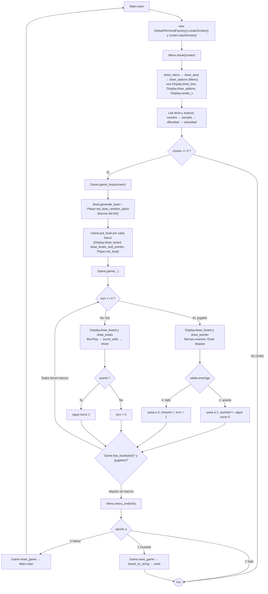
```mermaid
flowchart TD
A["Main.main"] --> B["new DefaultTerminalFactory().createScreen() y screen.startScreen()"]
B --> C["Menu.show(screen)"]
C --> C1["draw_menu → draw_ascii → draw_options (Menu)<br/>usa Display.draw_box, Display.draw_options, Display.center_x"]
C1 --> C2["Lee tecla y avanza: nombre → tamaño → dificultad → velocidad"]
C2 --> D{"choice == 0 ?"}
D -- "No (Salir)" --> Z(["Fin"])
D -- "Sí" --> E["Game.game_loop(screen)"]
E --> E1["Boat.generate_boat + Player.set_boat_random_place<br/>(barcos del bot)"]
E1 --> E2["Game.put_boat por cada barco<br/>(Display.draw_board, draw_boats_and_pointer, Player.set_boat)"]
E2 --> F["Game.game(...)"]
F --> G{"turn == 0 ?"}
G -- "Sí: jugador" --> H["Display.draw_board y draw_pointer<br/>flechas mueven, Enter dispara"]
H --> H1{"celda enemiga"}
H1 -- "1: acierto" --> H2["pasa a 2, acerted++, sigue turno 0"]
H1 -- "0: fallo" --> H3["pasa a 3, missed++, turn = 1"]
G -- "No: bot" --> I["Display.draw_board y draw_boats<br/>Bot.Play → count_cells → shoot"]
I --> I1{"acertó ?"}
I1 -- "No" --> I2["turn = 0"]
I1 -- "Sí" --> I3["sigue turno 1"]
H2 --> J{"Game.has_boats(bot)? y (jugador)?"}
H3 --> J
I2 --> J
I3 --> J
J -- "Todos tienen barcos" --> G
J -- "Alguien sin barcos" --> K["Menu.menu_end(win)"]
K --> L{"opción a"}
L -- "0 Volver" --> M["Game.reset_game → Main.main"]
M --> A
L -- "1 Guardar" --> N["Game.save_game → board_to_string → write"]
L -- "2 Salir" --> Z
N --> Z
```


### Main.java


#### `main(String[] args)`

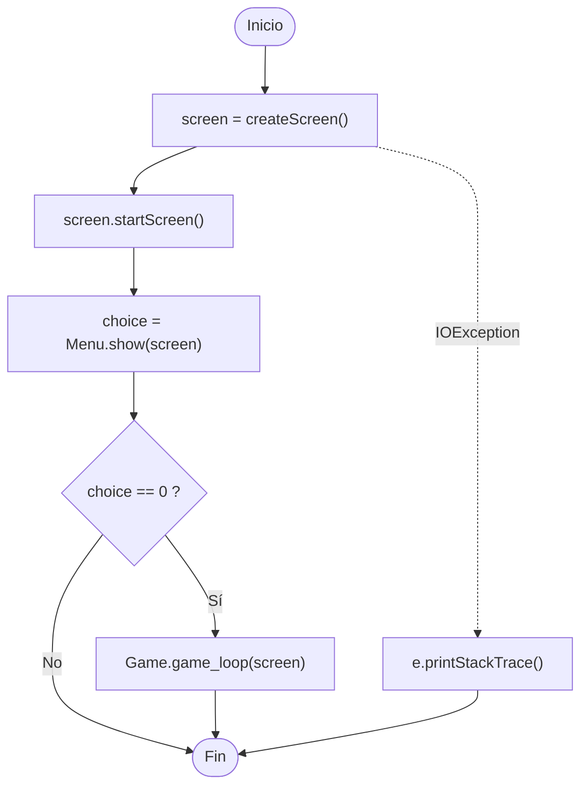
```mermaid
flowchart TD
A(["Inicio"]) --> B["screen = createScreen()"]
B --> C["screen.startScreen()"]
C --> D["choice = Menu.show(screen)"]
D --> E{"choice == 0 ?"}
E -- "Sí" --> F["Game.game_loop(screen)"]
E -- "No" --> G(["Fin"])
F --> G
B -. "IOException" .-> H["e.printStackTrace()"] --> G
```


### Menu.java


#### `show(Screen screen)`

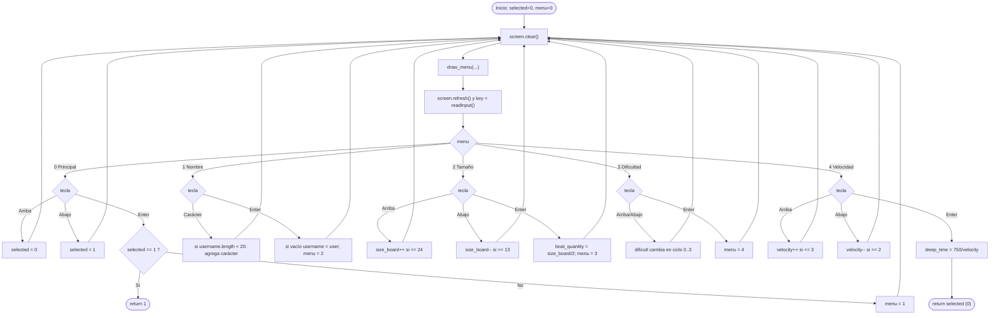
```mermaid
flowchart TD
A(["Inicio: selected=0, menu=0"]) --> B["screen.clear()"]
B --> C["draw_menu(...)"]
C --> D["screen.refresh() y key = readInput()"]
D --> E{"menu"}
E -- "0 Principal" --> F{"tecla"}
F -- "Arriba" --> F1["selected = 0"]
F -- "Abajo" --> F2["selected = 1"]
F -- "Enter" --> F3{"selected == 1 ?"}
F3 -- "Sí" --> R1(["return 1"])
F3 -- "No" --> F4["menu = 1"]
E -- "1 Nombre" --> G{"tecla"}
G -- "Carácter" --> G1["si username.length < 20: agrega carácter"]
G -- "Enter" --> G2["si vacío username = user; menu = 2"]
E -- "2 Tamaño" --> H{"tecla"}
H -- "Arriba" --> H1["size_board++ si <= 24"]
H -- "Abajo" --> H2["size_board-- si >= 13"]
H -- "Enter" --> H3["boat_quantity = size_board/2; menu = 3"]
E -- "3 Dificultad" --> I{"tecla"}
I -- "Arriba/Abajo" --> I1["dificult cambia en ciclo 0..3"]
I -- "Enter" --> I2["menu = 4"]
E -- "4 Velocidad" --> J{"tecla"}
J -- "Arriba" --> J1["velocity++ si <= 3"]
J -- "Abajo" --> J2["velocity-- si >= 2"]
J -- "Enter" --> J3["sleep_time = 750/velocity"] --> R2(["return selected (0)"])
F1 --> B
F2 --> B
F4 --> B
G1 --> B
G2 --> B
H1 --> B
H2 --> B
H3 --> B
I1 --> B
I2 --> B
J1 --> B
J2 --> B
```


#### `menu_end(txt, screen, win, columns)`

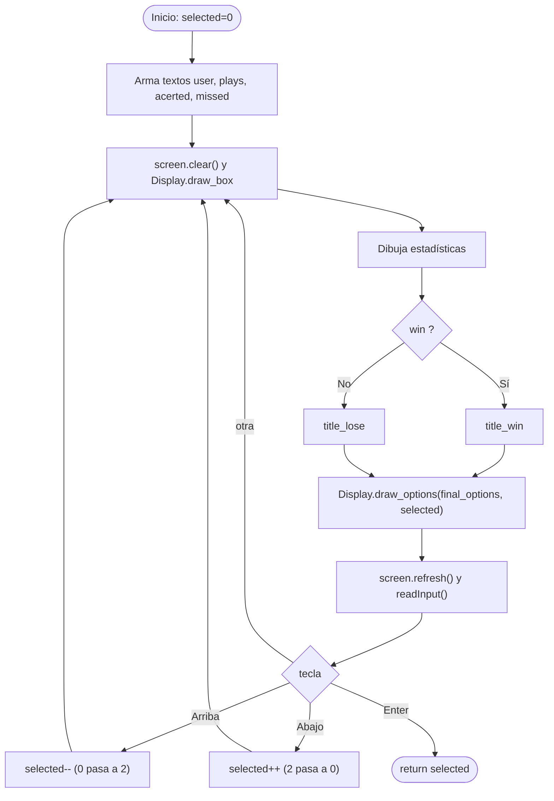
```mermaid
flowchart TD
A(["Inicio: selected=0"]) --> B["Arma textos user, plays, acerted, missed"]
B --> C["screen.clear() y Display.draw_box"]
C --> D["Dibuja estadísticas"]
D --> E{"win ?"}
E -- "Sí" --> E1["title_win"]
E -- "No" --> E2["title_lose"]
E1 --> F["Display.draw_options(final_options, selected)"]
E2 --> F
F --> G["screen.refresh() y readInput()"]
G --> H{"tecla"}
H -- "Arriba" --> H1["selected-- (0 pasa a 2)"] --> C
H -- "Abajo" --> H2["selected++ (2 pasa a 0)"] --> C
H -- "Enter" --> R(["return selected"])
H -- "otra" --> C
```


#### `draw_menu(txt, columns, selected, menu, dificult)`

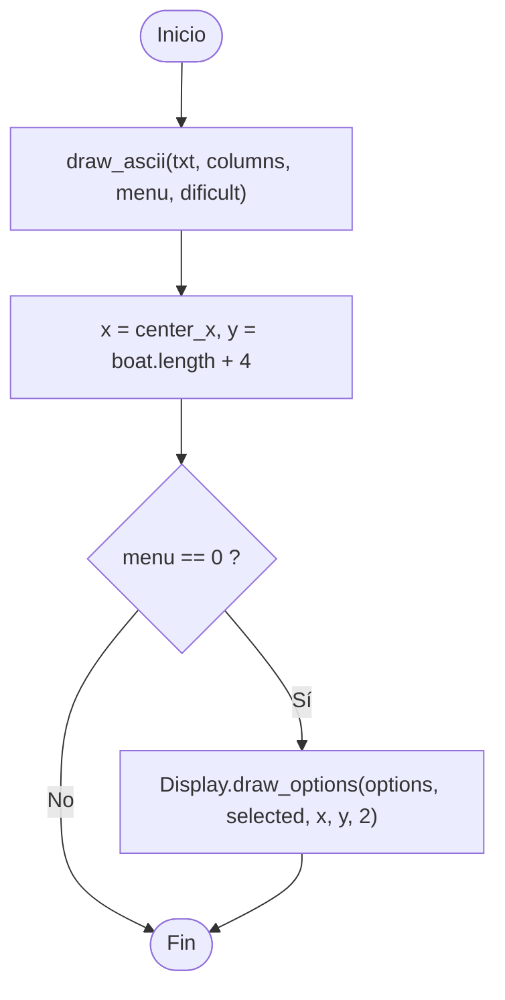
```mermaid
flowchart TD
A(["Inicio"]) --> B["draw_ascii(txt, columns, menu, dificult)"]
B --> C["x = center_x, y = boat.length + 4"]
C --> D{"menu == 0 ?"}
D -- "Sí" --> E["Display.draw_options(options, selected, x, y, 2)"]
D -- "No" --> F(["Fin"])
E --> F
```


#### `draw_ascii(txt, columns, menu, dificult)`

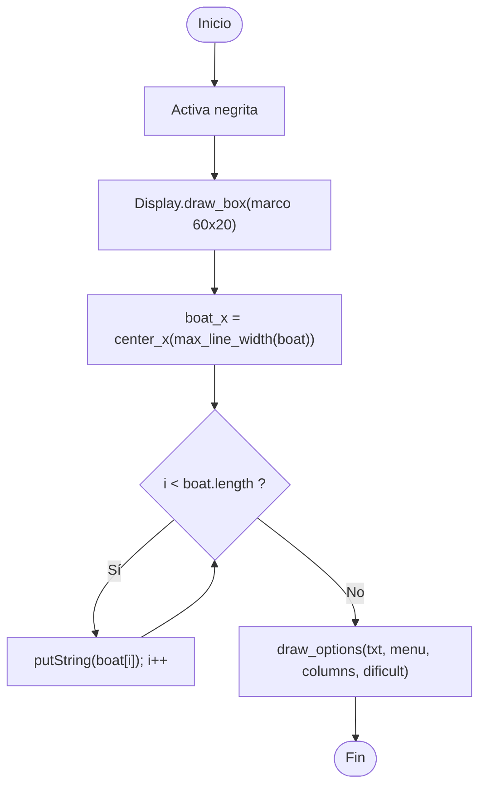
```mermaid
flowchart TD
A(["Inicio"]) --> B["Activa negrita"]
B --> C["Display.draw_box(marco 60x20)"]
C --> D["boat_x = center_x(max_line_width(boat))"]
D --> E{"i < boat.length ?"}
E -- "Sí" --> F["putString(boat[i]); i++"] --> E
E -- "No" --> G["draw_options(txt, menu, columns, dificult)"]
G --> H(["Fin"])
```


#### `draw_options(txt, menu, columns, dificult) (Menu)`

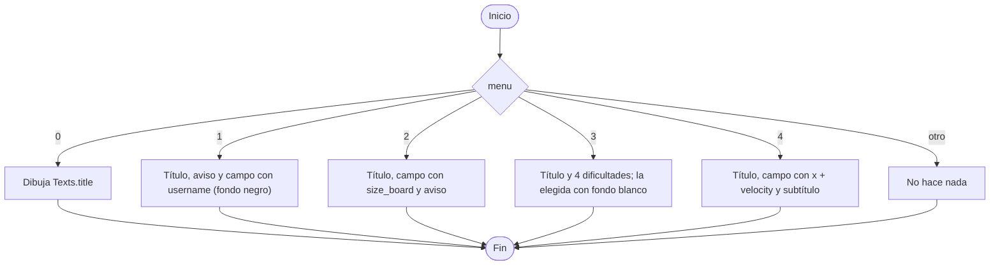
```mermaid
flowchart TD
A(["Inicio"]) --> B{"menu"}
B -- "0" --> C["Dibuja Texts.title"]
B -- "1" --> D["Título, aviso y campo con username (fondo negro)"]
B -- "2" --> E["Título, campo con size_board y aviso"]
B -- "3" --> F["Título y 4 dificultades; la elegida con fondo blanco"]
B -- "4" --> G["Título, campo con x + velocity y subtítulo"]
B -- "otro" --> H["No hace nada"]
C --> Z(["Fin"])
D --> Z
E --> Z
F --> Z
G --> Z
H --> Z
```


### Game.java


#### `game_loop(Screen screen)`

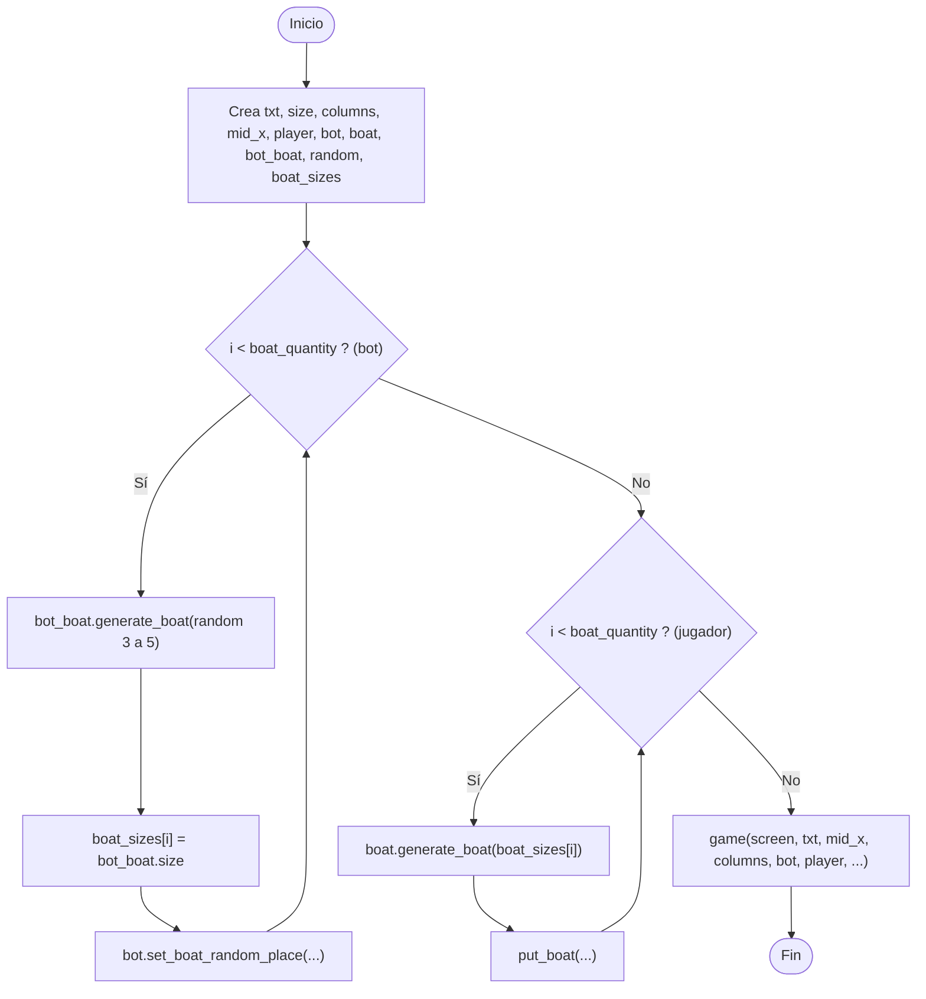
```mermaid
flowchart TD
A(["Inicio"]) --> B["Crea txt, size, columns, mid_x, player, bot, boat, bot_boat, random, boat_sizes"]
B --> C{"i < boat_quantity ? (bot)"}
C -- "Sí" --> D["bot_boat.generate_boat(random 3 a 5)"]
D --> D1["boat_sizes[i] = bot_boat.size"]
D1 --> D2["bot.set_boat_random_place(...)"] --> C
C -- "No" --> E{"i < boat_quantity ? (jugador)"}
E -- "Sí" --> F["boat.generate_boat(boat_sizes[i])"]
F --> G["put_boat(...)"] --> E
E -- "No" --> H["game(screen, txt, mid_x, columns, bot, player, ...)"]
H --> I(["Fin"])
```


#### `game(...)`

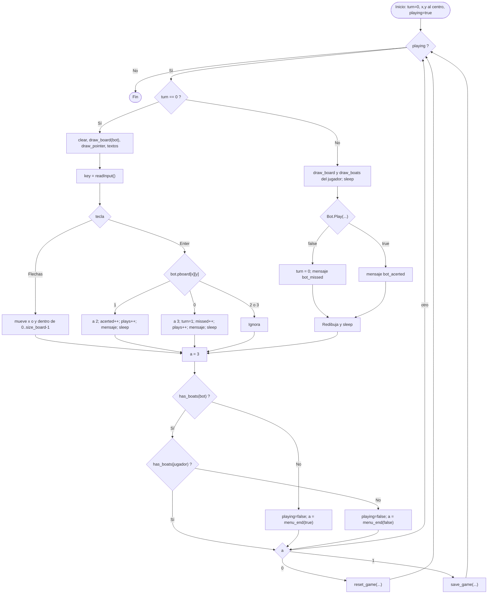
```mermaid
flowchart TD
A(["Inicio: turn=0, x,y al centro, playing=true"]) --> B{"playing ?"}
B -- "No" --> Z(["Fin"])
B -- "Sí" --> C{"turn == 0 ?"}
C -- "Sí" --> D["clear, draw_board(bot), draw_pointer, textos"]
D --> E["key = readInput()"]
E --> F{"tecla"}
F -- "Flechas" --> F1["mueve x o y dentro de 0..size_board-1"]
F -- "Enter" --> G{"bot.pboard[x][y]"}
G -- "1" --> G1["a 2; acerted++; plays++; mensaje; sleep"]
G -- "0" --> G2["a 3; turn=1; missed++; plays++; mensaje; sleep"]
G -- "2 o 3" --> G3["Ignora"]
C -- "No" --> H["draw_board y draw_boats del jugador; sleep"]
H --> I{"Bot.Play(...)"}
I -- "false" --> I1["turn = 0; mensaje bot_missed"]
I -- "true" --> I2["mensaje bot_acerted"]
I1 --> J["Redibuja y sleep"]
I2 --> J
F1 --> K
G1 --> K
G2 --> K
G3 --> K
J --> K["a = 3"]
K --> L{"has_boats(bot) ?"}
L -- "No" --> L1["playing=false; a = menu_end(true)"]
L -- "Sí" --> M{"has_boats(jugador) ?"}
M -- "No" --> M1["playing=false; a = menu_end(false)"]
M -- "Sí" --> N
L1 --> N{"a"}
M1 --> N
N -- "0" --> N1["reset_game(...)"]
N -- "1" --> N2["save_game(...)"]
N -- "otro" --> B
N1 --> B
N2 --> B
```


#### `put_boat(...)`

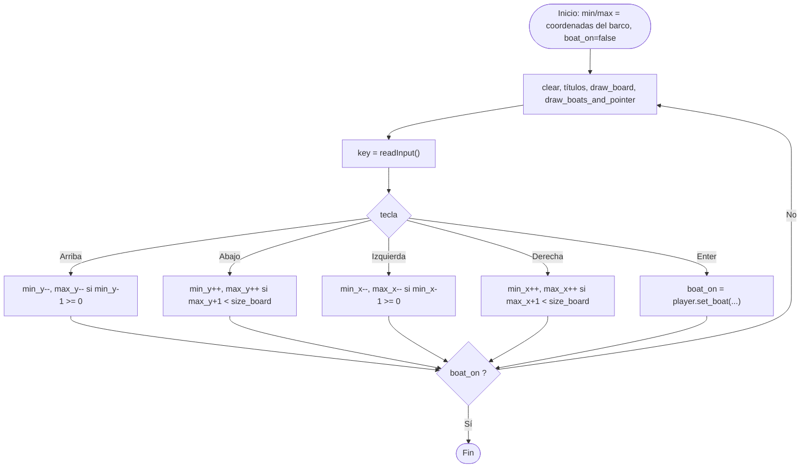
```mermaid
flowchart TD
A(["Inicio: min/max = coordenadas del barco, boat_on=false"]) --> B["clear, títulos, draw_board, draw_boats_and_pointer"]
B --> C["key = readInput()"]
C --> D{"tecla"}
D -- "Arriba" --> D1["min_y--, max_y-- si min_y-1 >= 0"]
D -- "Abajo" --> D2["min_y++, max_y++ si max_y+1 < size_board"]
D -- "Izquierda" --> D3["min_x--, max_x-- si min_x-1 >= 0"]
D -- "Derecha" --> D4["min_x++, max_x++ si max_x+1 < size_board"]
D -- "Enter" --> D5["boat_on = player.set_boat(...)"]
D1 --> E{"boat_on ?"}
D2 --> E
D3 --> E
D4 --> E
D5 --> E
E -- "No" --> B
E -- "Sí" --> F(["Fin"])
```


#### `has_boats(int[][] board)`

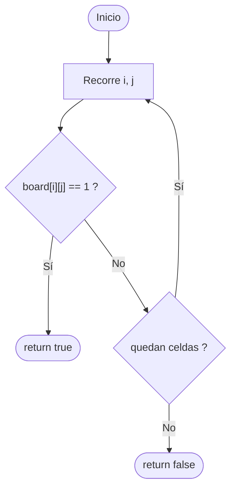
```mermaid
flowchart TD
A(["Inicio"]) --> B["Recorre i, j"]
B --> C{"board[i][j] == 1 ?"}
C -- "Sí" --> D(["return true"])
C -- "No" --> E{"quedan celdas ?"}
E -- "Sí" --> B
E -- "No" --> F(["return false"])
```


#### `reset_game(screen, player, bot)`

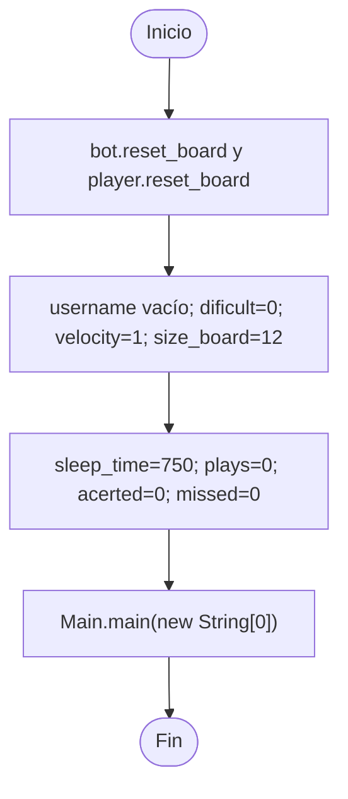
```mermaid
flowchart TD
A(["Inicio"]) --> B["bot.reset_board y player.reset_board"]
B --> C["username vacío; dificult=0; velocity=1; size_board=12"]
C --> D["sleep_time=750; plays=0; acerted=0; missed=0"]
D --> E["Main.main(new String[0])"]
E --> F(["Fin"])
```


#### `write(Path path, String content)`

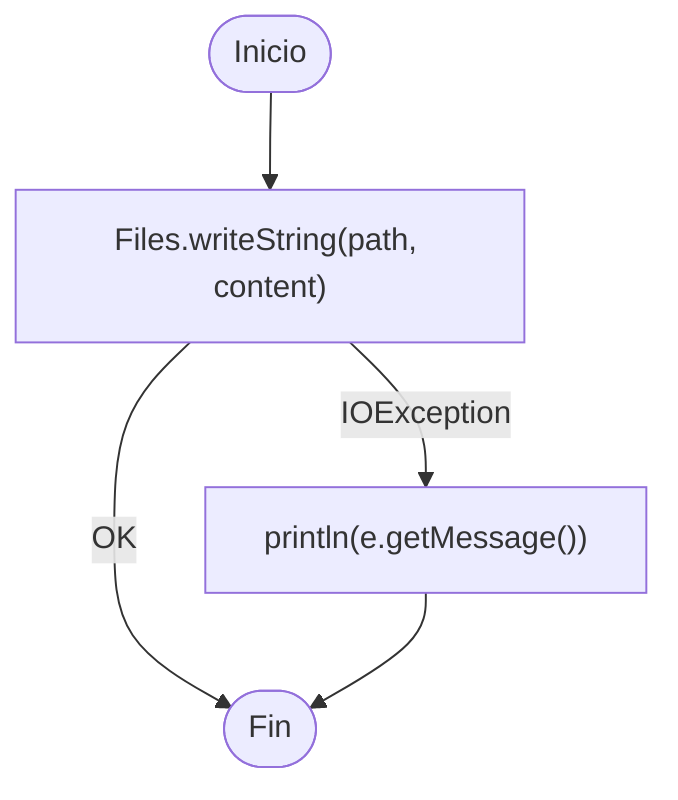
```mermaid
flowchart TD
A(["Inicio"]) --> B["Files.writeString(path, content)"]
B -- "OK" --> C(["Fin"])
B -- "IOException" --> D["println(e.getMessage())"] --> C
```


#### `board_to_string(int[][] board, int size)`

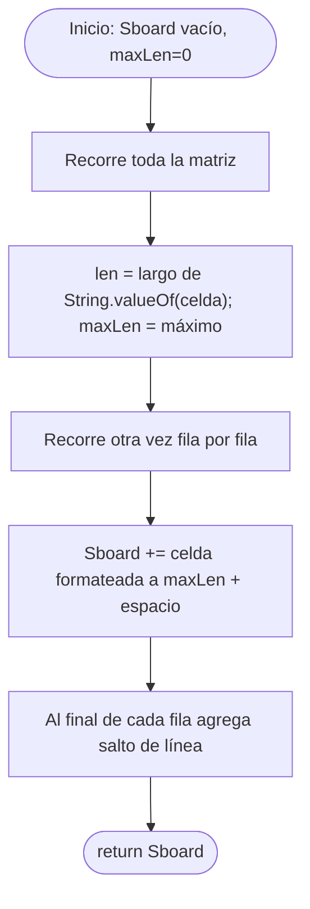
```mermaid
flowchart TD
A(["Inicio: Sboard vacío, maxLen=0"]) --> B["Recorre toda la matriz"]
B --> C["len = largo de String.valueOf(celda); maxLen = máximo"]
C --> D["Recorre otra vez fila por fila"]
D --> E["Sboard += celda formateada a maxLen + espacio"]
E --> F["Al final de cada fila agrega salto de línea"]
F --> G(["return Sboard"])
```


#### `save_game(bot_board, player_board, user, misses, acerts, size_board)`

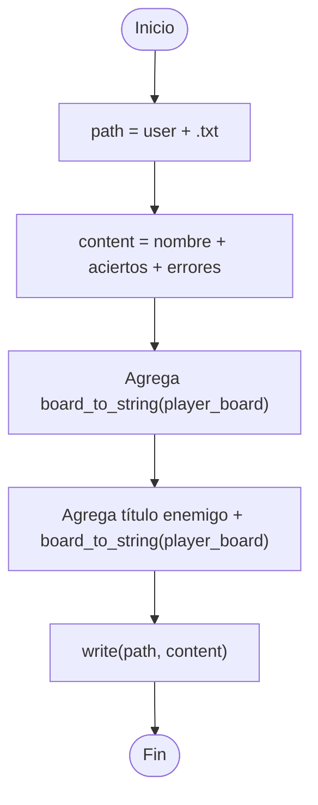
```mermaid
flowchart TD
A(["Inicio"]) --> B["path = user + .txt"]
B --> C["content = nombre + aciertos + errores"]
C --> D["Agrega board_to_string(player_board)"]
D --> E["Agrega título enemigo + board_to_string(player_board)"]
E --> F["write(path, content)"]
F --> G(["Fin"])
```


### Clases auxiliares (Game.java)


#### `Board.set_board(int x, int y)`

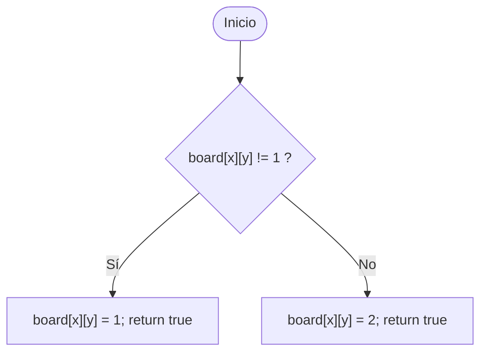
```mermaid
flowchart TD
A(["Inicio"]) --> B{"board[x][y] != 1 ?"}
B -- "Sí" --> C["board[x][y] = 1; return true"]
B -- "No" --> D["board[x][y] = 2; return true"]
```


#### `Boat.generate_boat(int size_boat)`

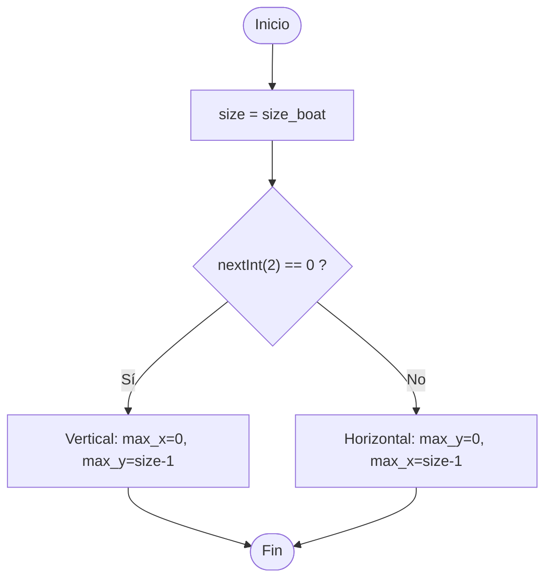
```mermaid
flowchart TD
A(["Inicio"]) --> B["size = size_boat"]
B --> C{"nextInt(2) == 0 ?"}
C -- "Sí" --> D["Vertical: max_x=0, max_y=size-1"]
C -- "No" --> E["Horizontal: max_y=0, max_x=size-1"]
D --> F(["Fin"])
E --> F
```


#### `Player.reset_board(size) y constructor Player(size)`

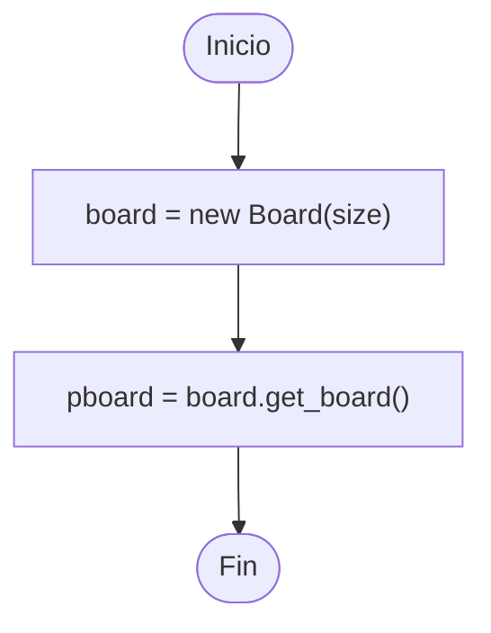
```mermaid
flowchart TD
A(["Inicio"]) --> B["board = new Board(size)"]
B --> C["pboard = board.get_board()"]
C --> D(["Fin"])
```


#### `Player.set_boat(min_x, max_x, min_y, max_y)`

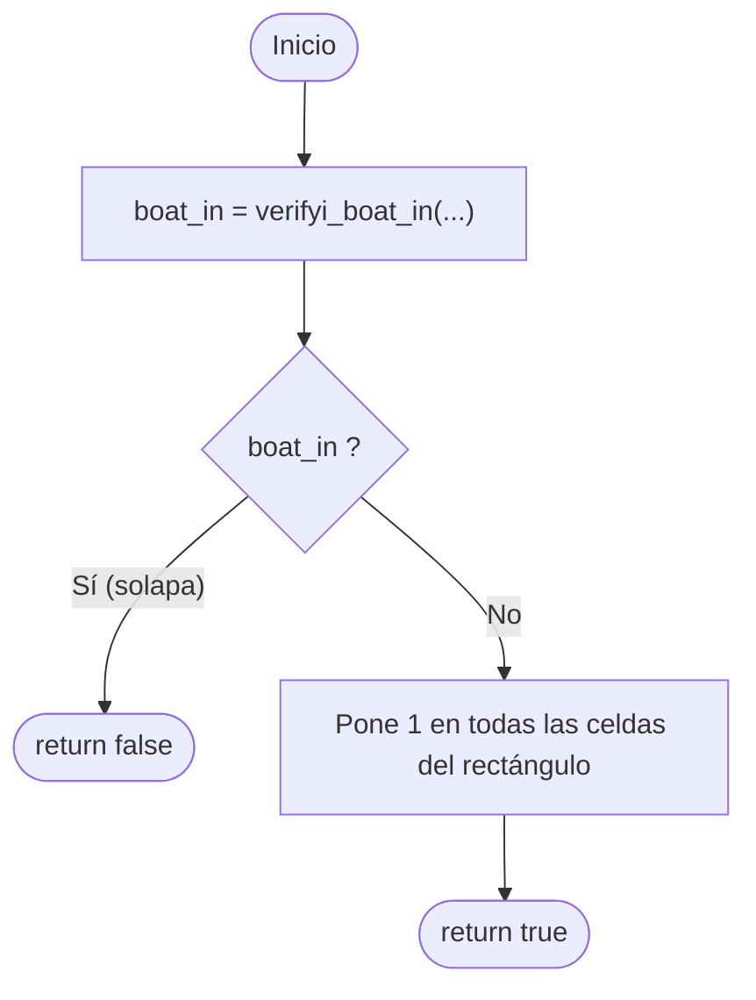
```mermaid
flowchart TD
A(["Inicio"]) --> B["boat_in = verifyi_boat_in(...)"]
B --> C{"boat_in ?"}
C -- "Sí (solapa)" --> D(["return false"])
C -- "No" --> E["Pone 1 en todas las celdas del rectángulo"]
E --> F(["return true"])
```


#### `Player.verifyi_boat_in(min_x, max_x, min_y, max_y)`

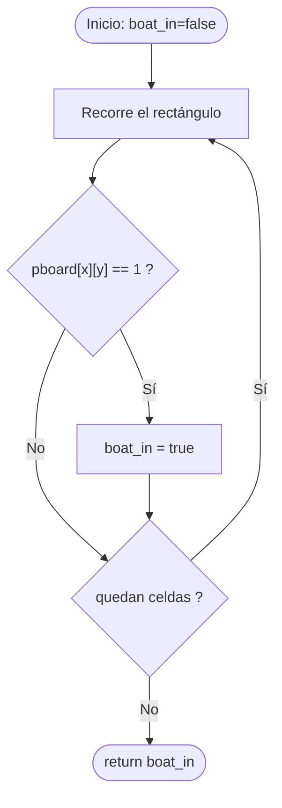
```mermaid
flowchart TD
A(["Inicio: boat_in=false"]) --> B["Recorre el rectángulo"]
B --> C{"pboard[x][y] == 1 ?"}
C -- "Sí" --> D["boat_in = true"]
C -- "No" --> E{"quedan celdas ?"}
D --> E
E -- "Sí" --> B
E -- "No" --> F(["return boat_in"])
```


#### `Player.set_boat_random_place(board, max_x, max_y, random, size_board)`

```mermaid
flowchart TD
A(["Inicio"]) --> B["x = random(size_board - max_x); y = random(size_board - max_y)"]
B --> C["free = true; revisa el área x..x+max_x, y..y+max_y"]
C --> D{"alguna celda == 1 ?"}
D -- "Sí" --> E["free = false"] --> B
D -- "No" --> F["Pone 1 en toda el área"]
F --> G(["return"])
```


### Bot.java


#### `Play(int[][] board, int size)`

```mermaid
flowchart TD
A(["Inicio: target = 0"]) --> B{"random(acuracity) == 0 ?"}
B -- "Sí" --> C["target = 1"]
B -- "No" --> D
C --> D["count = count_cells(board, size, target)"]
D --> E{"count == 0 ?"}
E -- "Sí" --> F["target = 1 - target; recuenta"]
E -- "No" --> G
F --> G["n = random(count); k = 0"]
G --> H["Recorre el tablero"]
H --> I{"board[i][j] == target ?"}
I -- "Sí" --> J{"k == n ?"}
J -- "Sí" --> K["shoot(board, i, j)"]
K --> L{"target == 1 ?"}
L -- "Sí" --> R1(["return true"])
L -- "No" --> R2(["return false"])
J -- "No" --> M["k++"] --> H
I -- "No" --> H
```


#### `count_cells(board, size, value)`

```mermaid
flowchart TD
A(["Inicio: count=0"]) --> B["Recorre i, j"]
B --> C{"board[i][j] == value ?"}
C -- "Sí" --> D["count++"]
C -- "No" --> E{"quedan celdas ?"}
D --> E
E -- "Sí" --> B
E -- "No" --> F(["return count"])
```


#### `shoot(board, x, y)`

```mermaid
flowchart TD
A(["Inicio"]) --> B{"board[x][y] == 1 ?"}
B -- "Sí" --> C["board[x][y] = 2"]
B -- "No" --> D["board[x][y] = 3"]
C --> E(["Fin"])
D --> E
```


### Display.java


#### `sleep(int sleep)`

```mermaid
flowchart TD
A(["Inicio"]) --> B["Thread.sleep(sleep)"]
B -- "OK" --> C(["Fin"])
B -- "InterruptedException" --> D["Thread.currentThread().interrupt()"] --> C
```


#### `center_x(total, width) y max_line_width(lines)`

```mermaid
flowchart LR
subgraph centrar["center_x"]
A(["total, width"]) --> B["return (total - width) / 2"]
end
subgraph ancho["max_line_width"]
C(["lines"]) --> D["max = 0"] --> E{"lines[i].length > max ?"}
E -- "Sí" --> F["max = lines[i].length"] --> G{"quedan líneas ?"}
E -- "No" --> G
G -- "Sí" --> E
G -- "No" --> H(["return max"])
end
```


#### `draw_box(txt, x, y, width, height, style)`

```mermaid
flowchart TD
A(["Inicio"]) --> B["Extrae las 6 piezas de style"]
B --> C["Bordes horizontales (arriba y abajo)"]
C --> D["Bordes verticales (izquierda y derecha)"]
D --> E["Cuatro esquinas"]
E --> F(["Fin"])
```


#### `draw_options(txt, options, selected, x, y, spacing)`

```mermaid
flowchart TD
A(["Inicio"]) --> B{"i < options.length ?"}
B -- "Sí" --> C{"i == selected ?"}
C -- "Sí" --> D["Fondo blanco, texto negro"]
C -- "No" --> E["Colores por defecto"]
D --> F["putString(x, y + i*spacing, options[i])"]
E --> F
F --> B
B -- "No" --> G["Restaura colores"] --> H(["Fin"])
```


#### `draw_board(txt, x, y, size, board)`

```mermaid
flowchart TD
A(["Inicio: negrita"]) --> B["Recorre i, j"]
B --> C{"board[i][j]"}
C -- "2" --> D["x roja"]
C -- "3" --> E["0 blanco"]
C -- "0 o 1" --> F["■ azul"]
D --> G["Restaura colores"]
E --> G
F --> G
G --> H{"quedan celdas ?"}
H -- "Sí" --> B
H -- "No" --> I(["Fin"])
```


#### `draw_boats(txt, board, size, x, y)`

```mermaid
flowchart TD
A(["Inicio"]) --> B["Recorre i, j"]
B --> C{"board[i][j] == 1 ?"}
C -- "Sí" --> D["■ rojo en (x+i*2, y+j); restaura colores"]
C -- "No" --> E{"quedan celdas ?"}
D --> E
E -- "Sí" --> B
E -- "No" --> F(["Fin"])
```


#### `draw_boats_and_pointer(txt, board, size, x, y, min_x, max_x, min_y, max_y)`

```mermaid
flowchart TD
A(["Inicio"]) --> B["Recorre i, j"]
B --> C{"board[i][j] == 1 ?"}
C -- "Sí" --> D["■ rojo (barco ya colocado)"]
C -- "No" --> E
D --> E{"(i,j) dentro de min..max ?"}
E -- "Sí" --> F["Fondo rojo, ■ azul"]
F --> G{"i > min_x ?"}
G -- "Sí" --> H["Rellena el espacio de la izquierda"]
G -- "No" --> I
H --> I["Restaura colores"]
E -- "No" --> J{"quedan celdas ?"}
I --> J
J -- "Sí" --> B
J -- "No" --> K(["Fin"])
```


#### `draw_pointer(mid, top, txt, x, y)`

```mermaid
flowchart TD
A(["Inicio"]) --> B["Azul sobre fondo rojo"]
B --> C["setCharacter(mid + x*2, top + y, ■)"]
C --> D["Restaura colores"] --> E(["Fin"])
```


`bot_animation()` está vacía y no ejecuta nada.

## Observaciones sobre el código

- **`save_game`** escribe dos veces `player_board`: la sección "tablero enemigo" repite el tablero del jugador en vez de usar `bot_board`.
- **`Bot.acuracity`** se calcula una sola vez al cargar la clase, así que no se actualiza si la dificultad cambia después de reiniciar. En dificultad 3 vale 1 y el bot siempre apunta a barcos (nunca falla).
- **`Menu.show`**: el tamaño máximo real del tablero es 25, porque la condición de subida es `<= 24`.
- **Código sin uso:** `Board.set_board`, `Player.set_board`, `Display.bot_animation`, `Texts.GameIndication3`, `game` y `rows` en `game_loop`.
- **`reset_game`** llama a `Main.main` recursivamente, lo que apila llamadas en cada reinicio.
- **`Menu.menu_end`** alinea las estadísticas usando el largo de `user`, por lo que las otras líneas quedan desplazadas.
