# Batalla Naval en terminal (Java + Lanterna)

Proyecto final **1MD** de Ismael y Yamandú. Juego de Batalla Naval.

## Contenido

1. [Estructura del proyecto](#estructura-del-proyecto)
2. [Controles](#controles)
3. [Arquitectura y flujo general](#arquitectura-y-flujo-general)
4. [Estados de las celdas](#estados-de-las-celdas)
5. [Glosario de variables globales](#glosario-de-variables-globales)
6. [Glosario de funciones](#glosario-de-funciones)
7. [Estructuras de datos](#estructuras-de-datos)
8. [Diagramas de flujo por función](#diagramas-de-flujo-por-función)

## Estructura del proyecto

```text
1MD-PtoyectoFinal/
├── lib/
│   └── lanterna-3.1.2.jar
├── src/
│   ├── Main.java            # Archivo principal
│   └── modules/
│       ├── Game.java        # Lógica del juego
│       ├── Menu.java        # Menús 
│       ├── Bot.java         # Bot
│       ├── Display.java     # Utilidades 
│       └── Texts.java       # Textos 
└── .gitignore
```

| Archivo | Rol |
|---|---|
| `Main.java` | Crea la pantalla, muestra el menú y lanza el juego. |
| `modules/Menu.java` | Menús de configuración (usuario, tamaño, dificultad, velocidad) y menú final. |
| `modules/Game.java` | Lógica del juego. Contiene además las clases auxiliares `Board`, `Boat` y `Player`. |
| `modules/Bot.java` | Decide los disparos del rival según la dificultad. |
| `modules/Display.java` | Define las utilidades de dibujado. |
| `modules/Texts.java` | Todos los textos y el arte ASCII. |

## Arquitectura y flujo general

`Main.main` → `Menu.show` (configuración) → `Game.game_loop` (coloca barcos) → `Game.game` (turnos) → `Menu.menu_end` → volver / guardar / salir.

## Estados de las celdas

El tablero es una matriz `int[][]` y cada celda guarda un número. Se accede como `board[x][y]`, donde **x = columna** e **y = fila**.

| Valor | Significado | Cómo se dibuja |
|---|---|---|
| `0` | Agua sin disparar | `■` azul |
| `1` | Barco intacto | `■` rojo  |
| `2` | Barco impactado (acierto) | `x` roja |
| `3` | Disparo fallado (agua) | `0` blanco |

## Glosario de variables globales

### Clase `Game`

| Variable | Tipo | Valor inicial | Qué hace |
|---|---|---|---|
| `size_board` | `int` | 12 | Lado del tablero (cuadrado N×N) (12 a 25). |
| `boat_quantity` | `int` | 0 | Cantidad de barcos por jugador. El menú la fija como `size_board / 2`. |
| `dificult` | `int` | 0 | Dificultad: 0 Fácil, 1 Medio, 2 Difícil, 3 Imposible. La usa `Bot`. |
| `velocity` | `int` | 1 | Multiplicador de velocidad de animaciones (x1 a x4). |
| `sleep_time` | `int` | 750 | Milisegundos de pausa entre mensajes. |
| `plays` | `int` | 0 | Total de disparos del jugador. |
| `acerted` | `int` | 0 | Disparos acertados del jugador. |
| `missed` | `int` | 0 | Disparos fallados del jugador. |

### Clase `Menu`

| Variable | Tipo | Qué hace |
|---|---|---|
| `box_style` | `char[]` | Caracteres del marco: `{┌, ┐, └, ┘, ─, │}` (esquina sup-izq, sup-der, inf-izq, inf-der, horizontal, vertical). |
| `box_width` | `int` = 60 | Ancho del marco de los menús. |
| `box_height` | `int` = 20 | Alto del marco de los menús. |
| `username` | `String` = "" | Nombre del jugador (máx. 20 caracteres). Se usa en el menú final y como nombre del archivo guardado. |

### Clase `Bot`

| Variable | Tipo | Qué hace |
|---|---|---|
| `random` | `Random` | Generador aleatorio del bot. |
| `acuracity` | `int` = `4 - Game.dificult` | Parámetro de puntería. Cuanto menor, más probable que el bot apunte a un barco. |

### Clase `Texts`

Todas son `public static` y contienen cadenas del juego.

| Variable | Tipo | Qué contiene |
|---|---|---|
| `boat` | `String[]` | Arte ASCII del barco del menú (7 líneas). |
| `options` | `String[]` | Botones del menú principal: Jugar, Salir. |
| `final_options` | `String[]` | Botones del menú final: Volver, Guardar, Salir. |
| `dificulty` | `String[]` | Etiquetas: Fácil, Medio, Difícil, Imposible. |
| `title`, `title_username`, `title_board_size`, `title_dificult`, `title_velocity` | `String` | Títulos de cada pantalla del menú. |
| `title_put_boat`, `title_down_put_boat` | `String` | Títulos de la pantalla de colocar barcos. |
| `title_win`, `title_lose` | `String` | Mensajes de victoria o derrota. |
| `subtitle_velocity`, `warning`, `warning_two` | `String` | Subtítulos e indicaciones de ayuda. |
| `blank_space`, `blank_space_board`, `blank_space_velocity` | `String` | Espacios en blanco que dibujan el campo de entrada con fondo negro. |
| `acerted`, `missed`, `bot_acerted`, `bot_missed` | `String` | Mensajes tras cada disparo. |
| `GameIndication1` a `GameIndication5` | `String` | Indicaciones durante la partida |

## Glosario de funciones

### `Main.java`

#### `main(String[] args)`
- **`screen`** (`Screen`): pantalla de la terminal de Lanterna, creada con `DefaultTerminalFactory` e iniciada con `startScreen()`.
- **`choice`** (`int`): resultado de `Menu.show`. `0` = jugar, `1` = salir.
- **Qué hace:** abre la pantalla, muestra el menú y, si se eligió jugar, llama a `Game.game_loop`. Captura `IOException` e imprime el error.

### `Menu.java`

#### `show(Screen screen)` → `int`
Controla todos los menús de configuración. Devuelve la opción elegida (0 = jugar, 1 = salir).
- **`txt`** (`TextGraphics`): escribe texto en la pantalla.
- **`selected`** (`int`): opción resaltada del menú principal (0 Jugar, 1 Salir).
- **`menu`** (`int`): máquina de estados con la pantalla actual: 0 principal, 1 nombre, 2 tamaño, 3 dificultad, 4 velocidad.
- **`size`** (`TerminalSize`): tamaño actual de la terminal (para centrar).
- **`key`** (`KeyStroke`): tecla presionada, leída con `screen.readInput()`.
- **`username_input`** (`String`): carácter tipeado que se agrega a `username`.
- **Qué hace:** en un bucle infinito limpia la pantalla, dibuja el menú, lee una tecla y, según `menu`, actualiza la variable global correspondiente (`username`, `Game.size_board`, `Game.boat_quantity`, `Game.dificult`, `Game.velocity`, `Game.sleep_time`) y avanza a la siguiente pantalla.

#### `menu_end(TextGraphics txt, Screen screen, boolean win, int columns)` → `int`
- **Parámetros:** `txt`, `screen`, `win` (true si ganó el jugador), `columns` (ancho de la terminal).
- **`selected`** (`int`): opción resaltada (0 Volver, 1 Guardar, 2 Salir).
- **`user`, `plays`, `acerted`, `missed`** (`String`): líneas con el nombre y las estadísticas.
- **`key`** (`KeyStroke`): tecla presionada.
- **Qué hace:** dibuja el marco, las estadísticas, el título de victoria o derrota y los botones. Las flechas mueven la selección de forma circular y Enter devuelve el índice elegido.

#### `draw_ascii(TextGraphics txt, int columns, int menu, int dificult)` (privada)
- **`boat_x`** (`int`): columna inicial del barco ASCII, centrado según la línea más ancha.
- **`i`** (`int`): índice del bucle sobre `Texts.boat`.
- **Qué hace:** activa negrita, dibuja el marco y el barco ASCII línea por línea, y llama a `draw_options` para el contenido de la pantalla actual.

#### `draw_options(TextGraphics txt, int menu, int columns, int dificult)` (privada)
- **`i`** (`int`): índice sobre `Texts.dificulty`.
- **Qué hace:** con un `switch` dibuja el título y los campos de cada pantalla: nombre (fondo negro con `username`), tamaño (`Game.size_board`), lista de dificultades (la elegida con fondo blanco) y velocidad (`x` + `Game.velocity`).

#### `draw_menu(TextGraphics txt, int columns, int selected, int menu, int dificult)` (privada)
- **`x`, `y`** (`int`): posición de los botones principales.
- **Qué hace:** llama a `draw_ascii` y, solo en el menú principal, dibuja los botones Jugar y Salir con `Display.draw_options`.

### `Game.java`

#### `game_loop(Screen screen)`
- **`txt`** (`TextGraphics`), **`size`** (`TerminalSize`), **`columns`**, **`rows`** (`int`, `rows` no se usa).
- **`mid_x`** (`int`): columna donde empieza el tablero para quedar centrado.
- **`player`, `bot`** (`Player`): jugador humano y rival, cada uno con su tablero.
- **`boat`** (`Boat`): barco que el jugador va a colocar. **`bot_boat`** (`Boat`): barco generado para el bot.
- **`random`** (`Random`), **`username`** (`String`, copia de `Menu.username`), **`game`** (`boolean`, no se usa).
- **`boat_sizes`** (`int[]`): tamaño de cada barco (largo `boat_quantity`). Hace que el jugador tenga **los mismos barcos que el bot**.
- **Qué hace:** (1) por cada barco genera uno de tamaño 3 a 5 para el bot, lo guarda en `boat_sizes` y lo ubica al azar; (2) por cada tamaño guardado pide al jugador colocar su barco con `put_boat`; (3) llama a `game`.

#### `game(Screen screen, TextGraphics txt, int mid_x, int columns, Player bot, Player player, int[][] pboard, String username)`
- **`turn`** (`int`): 0 = turno del jugador, 1 = turno del bot.
- **`x`, `y`** (`int`): posición del puntero en el tablero enemigo. Inicia en el centro.
- **`playing`** (`boolean`): controla el bucle principal.
- **`key`** (`KeyStroke`): tecla presionada.
- **`target`** (`int[][]`): referencia al tablero del bot (`bot.pboard`).
- **`a`** (`int`): opción del menú final (0 volver, 1 guardar, 2 salir; 3 = sin acción).
- **Qué hace:**
  - *Turno del jugador:* dibuja el tablero enemigo (sin mostrar barcos) y el puntero; las flechas lo mueven; con Enter dispara. Si la celda vale 1 pasa a 2 (acierto, sigue jugando); si vale 0 pasa a 3 (fallo, pasa el turno). Actualiza `acerted`, `missed` y `plays`.
  - *Turno del bot:* muestra el tablero propio con barcos, llama a `Bot.Play`; si falla devuelve el turno al jugador.
  - *Fin:* con `has_boats` revisa ambos tableros; si alguno queda sin barcos abre `Menu.menu_end` y ejecuta `reset_game` (volver) o `save_game` (guardar).

#### `put_boat(int columns, Screen screen, TextGraphics txt, int mid, int x1, int x2, int y1, int y2, int[][] board, Player player)`
- **`min_x`, `max_x`, `min_y`, `max_y`** (`int`): rectángulo que ocupa el barco, inicializado con las coordenadas del barco generado.
- **`boat_on`** (`boolean`): `true` cuando el barco se colocó con éxito.
- **`key`** (`KeyStroke`): tecla presionada.
- **Qué hace:** dibuja el tablero, los barcos ya puestos y el barco actual. Las flechas desplazan el barco. Con Enter llama a `player.set_boat`, que solo acepta si no hay solapamiento.

#### `has_boats(int[][] board)` → `boolean`
- **`i`, `j`** (`int`): índices de recorrido.
- **Qué hace:** devuelve `true` si queda al menos una celda con valor 1. Sirve para detectar al ganador.

#### `reset_game(Screen screen, Player player, Player bot)`
- **Qué hace:** recrea los tableros vacíos con `reset_board`, restablece las variables globales (`username`, `dificult`, `velocity`, `size_board`, `sleep_time`, `plays`, `acerted`, `missed`) y llama a `Main.main` para volver al menú.

#### `write(Path path, String content)`
- **Qué hace:** escribe el texto en el archivo con `Files.writeString`. Si falla, imprime el mensaje del error.

#### `board_to_string(int[][] board, int size)` → `String`
- **`Sboard`** (`String`): texto acumulado. **`maxLen`** (`int`): ancho del número más largo. **`len`** (`int`): largo de cada número.
- **Qué hace:** convierte la matriz en texto con cada número alineado a `maxLen` y una fila por línea.

#### `save_game(int[][] bot_board, int[][] player_board, String user, int misses, int acerts, int size_board)`
- **`path`** (`Path`): archivo `<usuario>.txt`. **`content`** (`String`): nombre, tiros acertados y errados, y tableros.
- **Qué hace:** arma el reporte y lo guarda con `write`.

### Clases auxiliares en `Game.java`

#### Clase `Board`
- **`board`** (`int[][]`, privado): matriz N×N inicializada en 0.
- **`Board(int size)`**: crea la matriz.
- **`get_board()`**: devuelve la matriz.
- **`set_board(int x, int y)`**: si la celda no es 1 la pone en 1; si ya es 1 la pone en 2. Devuelve `true`. (No se usa en el juego.)

#### Clase `Boat`
- **`horizontal`** (`boolean`, privado): orientación.
- **`size`** (`int`): largo del barco.
- **`min_x`, `min_y`** (`int`): esquina inicial, siempre 0.
- **`max_x`, `max_y`** (`int`): esquina final. Vertical: `max_x = 0`, `max_y = size-1`. Horizontal: `max_y = 0`, `max_x = size-1`.
- **`generate_boat(int size_boat)`**: guarda el tamaño y elige orientación al azar con una variable local `a` (`Random`).

#### Clase `Player`
- **`board`** (`Board`) y **`pboard`** (`int[][]`): objeto tablero y acceso directo a su matriz.
- **`Player(int size)`** y **`reset_board(int size)`**: crean un tablero nuevo y vacío.
- **`set_boat(min_x, max_x, min_y, max_y)`** → `boolean`: si no hay solapamiento marca con 1 el rectángulo y devuelve `true`. Variable local: `boat_in`.
- **`verifyi_boat_in(min_x, max_x, min_y, max_y)`** → `boolean`: devuelve `true` si alguna celda del rectángulo ya vale 1. Variable local: `boat_in`.
- **`get_board()`** y **`set_board(int x, int y)`**: delegan en `Board`.
- **`set_boat_random_place(int[][] board, int max_x, int max_y, Random random, int size_board)`**: variables locales `x`, `y` (esquina aleatoria limitada para no salirse) y `free` (`boolean`, área libre). Repite hasta encontrar un lugar libre y marca las celdas con 1.

### `Bot.java`

#### `Play(int[][] board, int size)` → `boolean`
Disparo del bot sobre el tablero del jugador. Devuelve `true` si acierta.
- **`target`** (`int`): tipo de celda a la que apunta (1 = barco, 0 = agua).
- **`count`** (`int`): cantidad de celdas candidatas.
- **`n`** (`int`): índice aleatorio de la celda elegida. **`k`** (`int`): contador del recorrido. **`i`, `j`** (`int`): índices.
- **Qué hace:** con probabilidad `1/acuracity` apunta a un barco; si no, a agua. Cuenta candidatas, elige una al azar y dispara con `shoot`. Si no quedan celdas de ese tipo, cambia de objetivo con `1 - target`.

#### `count_cells(int[][] board, int size, int value)` → `int` (privada)
Cuenta cuántas celdas tienen el valor indicado (acumulador `count`).

#### `shoot(int[][] board, int x, int y)` (privada)
Si la celda es 1 la cambia a 2 (impacto); en otro caso la cambia a 3 (fallo).

### `Display.java`

| Función | Qué hace |
|---|---|
| `sleep(int sleep)` | Pausa `sleep` milisegundos con `Thread.sleep`. Si se interrumpe, restaura el estado de interrupción del hilo. |
| `center_x(int total, int width)` → `int` | Devuelve `(total - width) / 2`, la columna inicial para centrar un elemento. |
| `max_line_width(String[] lines)` → `int` | Devuelve el largo de la línea más larga (variable `max`). |
| `draw_box(txt, x, y, width, height, style)` | Dibuja un marco con los 6 caracteres de `style` (variables `top_left`, `top_right`, `bottom_left`, `bottom_right`, `horizontal`, `vertical`). |
| `draw_options(txt, options, selected, x, y, spacing)` | Escribe las opciones en vertical; la `selected` con fondo blanco y texto negro. Restaura los colores al final. |
| `draw_board(txt, x, y, size, board)` | Dibuja cada celda según su valor: 2 → `x` roja, 3 → `0` blanca, 0 y 1 → `■` azul. |
| `draw_boats(txt, board, size, x, y)` | Pinta de rojo con `■` las celdas con valor 1 (barcos intactos del jugador). |
| `draw_boats_and_pointer(txt, board, size, x, y, min_x, max_x, min_y, max_y)` | Dibuja los barcos colocados en rojo y el barco que se está colocando con fondo rojo, rellenando el espacio entre celdas contiguas. |
| `bot_animation()` |                                      |
| `draw_pointer(mid, top, txt, x, y)` | Dibuja el puntero (`■` azul sobre fondo rojo) en la celda `(x, y)` y restaura los colores. |

## Estructuras de datos

| Estructura | Dónde | Para qué sirve |
|---|---|---|
| `int[][]` | `Board`, `Player.pboard` | Tablero N×N con los estados 0 a 3. |
| `int[]` `boat_sizes` | `game_loop` | Tamaños de los barcos, compartidos entre bot y jugador. |
| `String[]` | `Texts` | Listas de opciones y arte ASCII. |
| `char[]` `box_style` | `Menu` | Los 6 caracteres del marco. |
| `Board`, `Boat`, `Player` | `Game.java` | Clases de dominio del juego. |
| `Screen`, `TextGraphics`, `KeyStroke`, `TerminalSize` | Lanterna | Pantalla, dibujo, teclado y tamaño de la terminal. |
| `Random` | `Game`, `Boat`, `Bot` | Generación aleatoria. |
| `Path` | `Game.save_game` | Ruta del archivo de guardado. |

## Diagramas de flujo por función

### Flujo de todo el proyecto

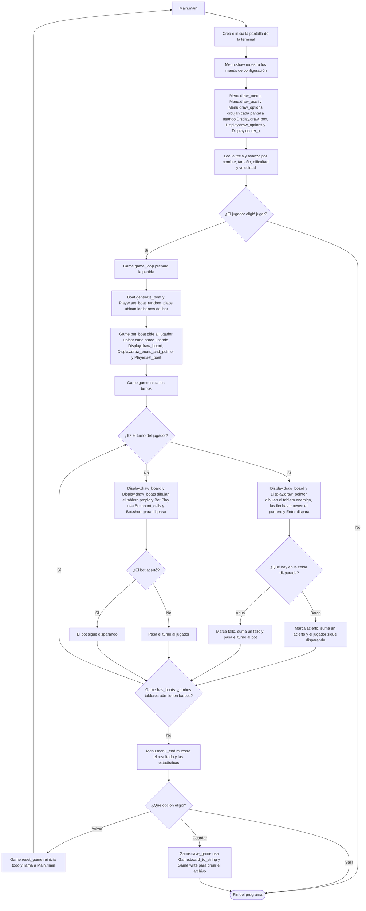
```mermaid
flowchart TD
A["Main.main"] --> B["Crea e inicia la pantalla de la terminal"]
B --> C["Menu.show muestra los menús de configuración"]
C --> C1["Menu.draw_menu, Menu.draw_ascii y Menu.draw_options dibujan cada pantalla usando Display.draw_box, Display.draw_options y Display.center_x"]
C1 --> C2["Lee la tecla y avanza por nombre, tamaño, dificultad y velocidad"]
C2 --> D{"¿El jugador eligió jugar?"}
D -- "No" --> Z(["Fin del programa"])
D -- "Sí" --> E["Game.game_loop prepara la partida"]
E --> E1["Boat.generate_boat y Player.set_boat_random_place ubican los barcos del bot"]
E1 --> E2["Game.put_boat pide al jugador ubicar cada barco usando Display.draw_board, Display.draw_boats_and_pointer y Player.set_boat"]
E2 --> F["Game.game inicia los turnos"]
F --> G{"¿Es el turno del jugador?"}
G -- "Sí" --> H["Display.draw_board y Display.draw_pointer dibujan el tablero enemigo, las flechas mueven el puntero y Enter dispara"]
H --> H1{"¿Qué hay en la celda disparada?"}
H1 -- "Barco" --> H2["Marca acierto, suma un acierto y el jugador sigue disparando"]
H1 -- "Agua" --> H3["Marca fallo, suma un fallo y pasa el turno al bot"]
G -- "No" --> I["Display.draw_board y Display.draw_boats dibujan el tablero propio y Bot.Play usa Bot.count_cells y Bot.shoot para disparar"]
I --> I1{"¿El bot acertó?"}
I1 -- "No" --> I2["Pasa el turno al jugador"]
I1 -- "Sí" --> I3["El bot sigue disparando"]
H2 --> J{"Game.has_boats: ¿ambos tableros aún tienen barcos?"}
H3 --> J
I2 --> J
I3 --> J
J -- "Sí" --> G
J -- "No" --> K["Menu.menu_end muestra el resultado y las estadísticas"]
K --> L{"¿Qué opción eligió?"}
L -- "Volver" --> M["Game.reset_game reinicia todo y llama a Main.main"]
M --> A
L -- "Guardar" --> N["Game.save_game usa Game.board_to_string y Game.write para crear el archivo"]
L -- "Salir" --> Z
N --> Z
```

### Main.java

#### `main(String[] args)`

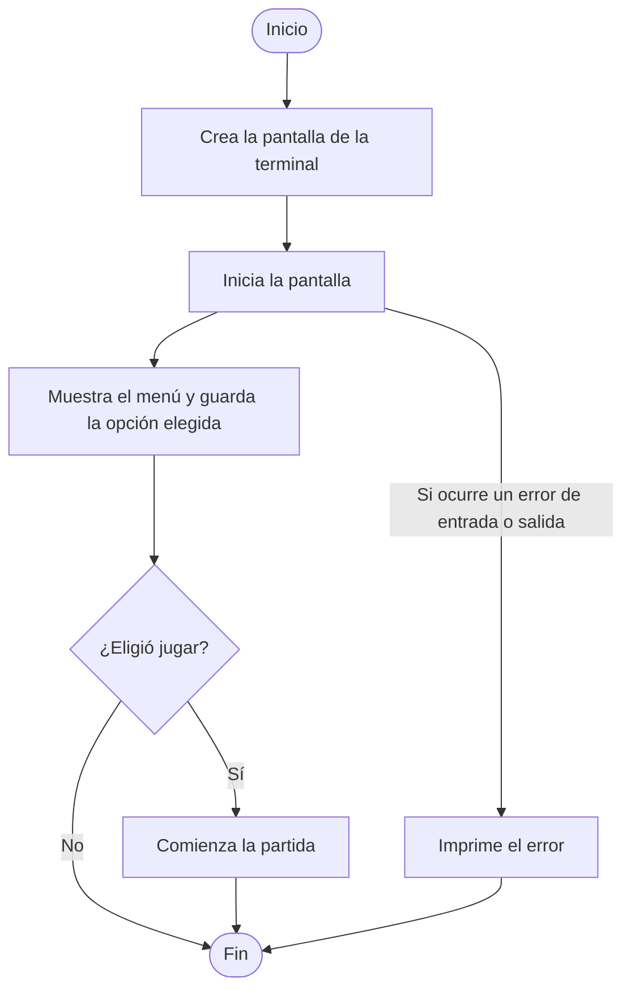
```mermaid
flowchart TD
A(["Inicio"]) --> B["Crea la pantalla de la terminal"]
B --> C["Inicia la pantalla"]
C --> D["Muestra el menú y guarda la opción elegida"]
D --> E{"¿Eligió jugar?"}
E -- "Sí" --> F["Comienza la partida"]
E -- "No" --> G(["Fin"])
F --> G
C -- "Si ocurre un error de entrada o salida" --> H["Imprime el error"]
H --> G
```

### Menu.java

#### `show(Screen screen)`

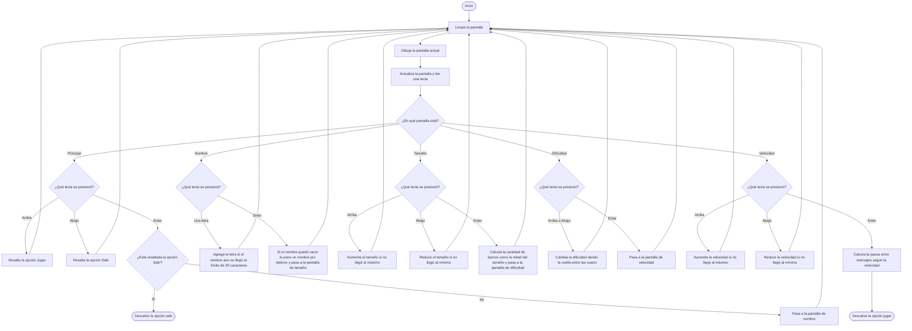
```mermaid
flowchart TD
A(["Inicio"]) --> B["Limpia la pantalla"]
B --> C["Dibuja la pantalla actual"]
C --> D["Actualiza la pantalla y lee una tecla"]
D --> E{"¿En qué pantalla está?"}
E -- "Principal" --> F{"¿Qué tecla se presionó?"}
F -- "Arriba" --> F1["Resalta la opción Jugar"]
F -- "Abajo" --> F2["Resalta la opción Salir"]
F -- "Enter" --> F3{"¿Está resaltada la opción Salir?"}
F3 -- "Sí" --> R1(["Devuelve la opción salir"])
F3 -- "No" --> F4["Pasa a la pantalla de nombre"]
E -- "Nombre" --> G{"¿Qué tecla se presionó?"}
G -- "Una letra" --> G1["Agrega la letra si el nombre aún no llegó al límite de 20 caracteres"]
G -- "Enter" --> G2["Si el nombre quedó vacío le pone un nombre por defecto y pasa a la pantalla de tamaño"]
E -- "Tamaño" --> H{"¿Qué tecla se presionó?"}
H -- "Arriba" --> H1["Aumenta el tamaño si no llegó al máximo"]
H -- "Abajo" --> H2["Reduce el tamaño si no llegó al mínimo"]
H -- "Enter" --> H3["Calcula la cantidad de barcos como la mitad del tamaño y pasa a la pantalla de dificultad"]
E -- "Dificultad" --> I{"¿Qué tecla se presionó?"}
I -- "Arriba o Abajo" --> I1["Cambia la dificultad dando la vuelta entre las cuatro"]
I -- "Enter" --> I2["Pasa a la pantalla de velocidad"]
E -- "Velocidad" --> J{"¿Qué tecla se presionó?"}
J -- "Arriba" --> J1["Aumenta la velocidad si no llegó al máximo"]
J -- "Abajo" --> J2["Reduce la velocidad si no llegó al mínimo"]
J -- "Enter" --> J3["Calcula la pausa entre mensajes según la velocidad"]
J3 --> R2(["Devuelve la opción jugar"])
F1 --> B
F2 --> B
F4 --> B
G1 --> B
G2 --> B
H1 --> B
H2 --> B
H3 --> B
I1 --> B
I2 --> B
J1 --> B
J2 --> B
```

#### `menu_end(txt, screen, win, columns)`

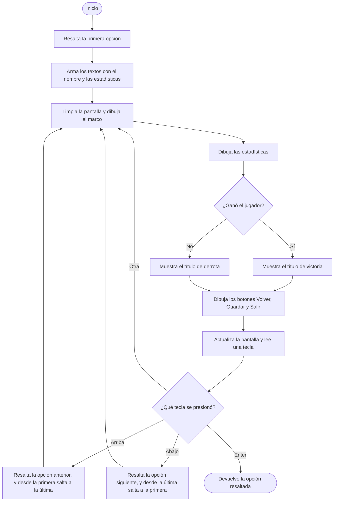
```mermaid
flowchart TD
A(["Inicio"]) --> B["Resalta la primera opción"]
B --> C["Arma los textos con el nombre y las estadísticas"]
C --> D["Limpia la pantalla y dibuja el marco"]
D --> E["Dibuja las estadísticas"]
E --> F{"¿Ganó el jugador?"}
F -- "Sí" --> F1["Muestra el título de victoria"]
F -- "No" --> F2["Muestra el título de derrota"]
F1 --> G["Dibuja los botones Volver, Guardar y Salir"]
F2 --> G
G --> H["Actualiza la pantalla y lee una tecla"]
H --> I{"¿Qué tecla se presionó?"}
I -- "Arriba" --> I1["Resalta la opción anterior, y desde la primera salta a la última"]
I -- "Abajo" --> I2["Resalta la opción siguiente, y desde la última salta a la primera"]
I -- "Enter" --> R(["Devuelve la opción resaltada"])
I -- "Otra" --> D
I1 --> D
I2 --> D
```

#### `draw_menu(txt, columns, selected, menu, dificult)`

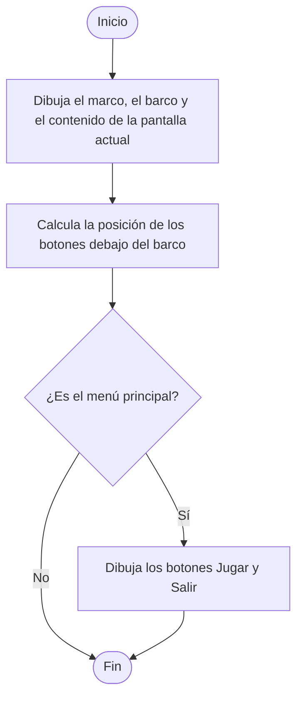
```mermaid
flowchart TD
A(["Inicio"]) --> B["Dibuja el marco, el barco y el contenido de la pantalla actual"]
B --> C["Calcula la posición de los botones debajo del barco"]
C --> D{"¿Es el menú principal?"}
D -- "Sí" --> E["Dibuja los botones Jugar y Salir"]
D -- "No" --> F(["Fin"])
E --> F
```

#### `draw_ascii(txt, columns, menu, dificult)`

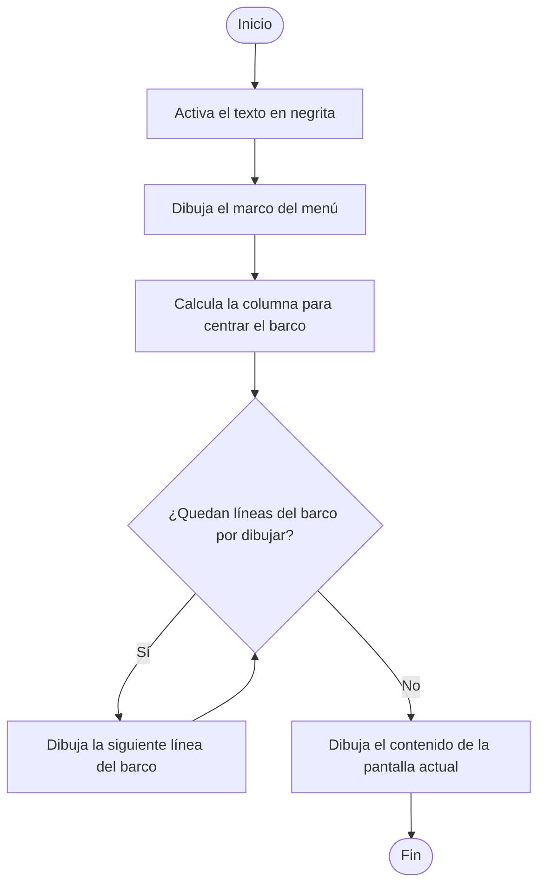
```mermaid
flowchart TD
A(["Inicio"]) --> B["Activa el texto en negrita"]
B --> C["Dibuja el marco del menú"]
C --> D["Calcula la columna para centrar el barco"]
D --> E{"¿Quedan líneas del barco por dibujar?"}
E -- "Sí" --> F["Dibuja la siguiente línea del barco"]
F --> E
E -- "No" --> G["Dibuja el contenido de la pantalla actual"]
G --> H(["Fin"])
```

#### `draw_options(txt, menu, columns, dificult)` (Menu)

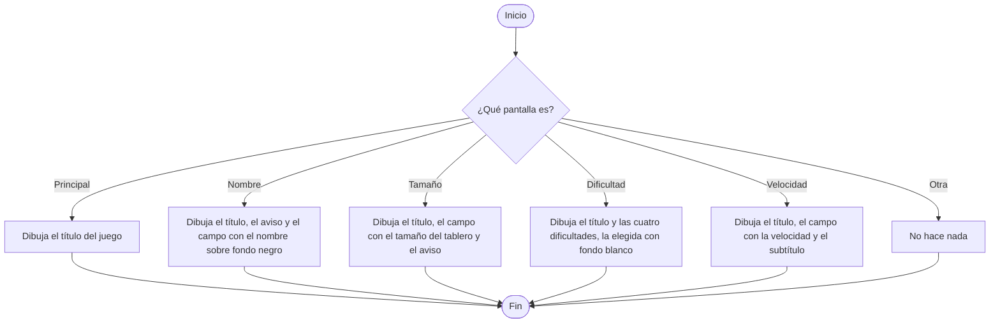
```mermaid
flowchart TD
A(["Inicio"]) --> B{"¿Qué pantalla es?"}
B -- "Principal" --> C["Dibuja el título del juego"]
B -- "Nombre" --> D["Dibuja el título, el aviso y el campo con el nombre sobre fondo negro"]
B -- "Tamaño" --> E["Dibuja el título, el campo con el tamaño del tablero y el aviso"]
B -- "Dificultad" --> F["Dibuja el título y las cuatro dificultades, la elegida con fondo blanco"]
B -- "Velocidad" --> G["Dibuja el título, el campo con la velocidad y el subtítulo"]
B -- "Otra" --> H["No hace nada"]
C --> Z(["Fin"])
D --> Z
E --> Z
F --> Z
G --> Z
H --> Z
```

### Game.java

#### `game_loop(Screen screen)`

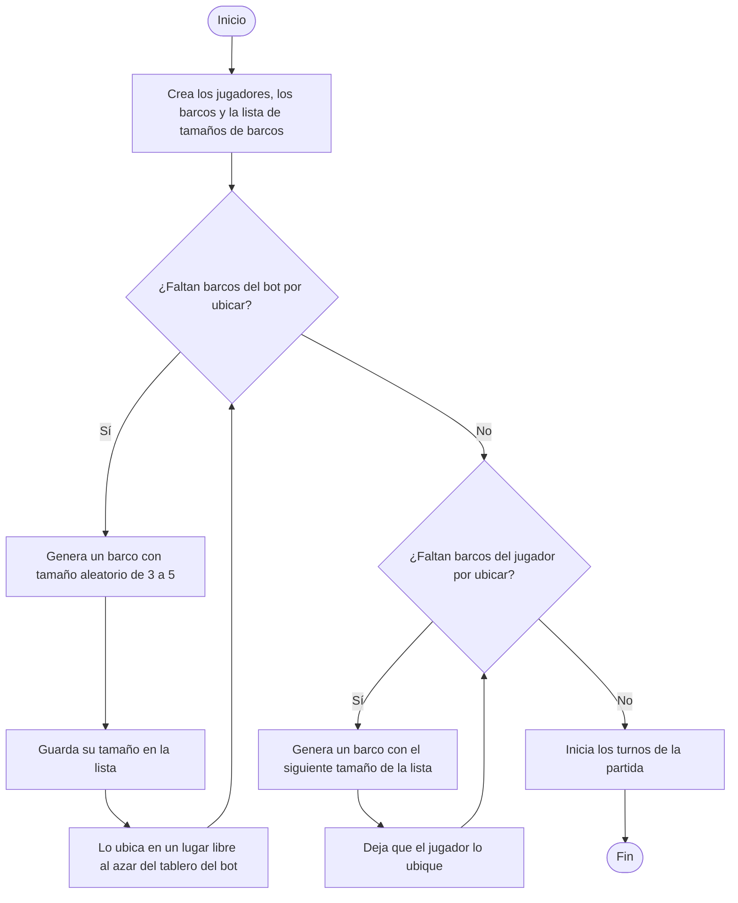
```mermaid
flowchart TD
A(["Inicio"]) --> B["Crea los jugadores, los barcos y la lista de tamaños de barcos"]
B --> C{"¿Faltan barcos del bot por ubicar?"}
C -- "Sí" --> D["Genera un barco con tamaño aleatorio de 3 a 5"]
D --> D1["Guarda su tamaño en la lista"]
D1 --> D2["Lo ubica en un lugar libre al azar del tablero del bot"]
D2 --> C
C -- "No" --> E{"¿Faltan barcos del jugador por ubicar?"}
E -- "Sí" --> F["Genera un barco con el siguiente tamaño de la lista"]
F --> G["Deja que el jugador lo ubique"]
G --> E
E -- "No" --> H["Inicia los turnos de la partida"]
H --> I(["Fin"])
```

#### `game(...)`

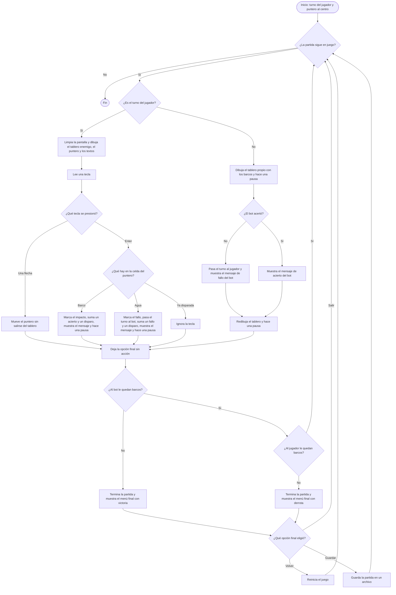
```mermaid
flowchart TD
A(["Inicio: turno del jugador y puntero al centro"]) --> B{"¿La partida sigue en juego?"}
B -- "No" --> Z(["Fin"])
B -- "Sí" --> C{"¿Es el turno del jugador?"}
C -- "Sí" --> D["Limpia la pantalla y dibuja el tablero enemigo, el puntero y los textos"]
D --> E["Lee una tecla"]
E --> F{"¿Qué tecla se presionó?"}
F -- "Una flecha" --> F1["Mueve el puntero sin salirse del tablero"]
F -- "Enter" --> G{"¿Qué hay en la celda del puntero?"}
G -- "Barco" --> G1["Marca el impacto, suma un acierto y un disparo, muestra el mensaje y hace una pausa"]
G -- "Agua" --> G2["Marca el fallo, pasa el turno al bot, suma un fallo y un disparo, muestra el mensaje y hace una pausa"]
G -- "Ya disparada" --> G3["Ignora la tecla"]
C -- "No" --> H["Dibuja el tablero propio con los barcos y hace una pausa"]
H --> I{"¿El bot acertó?"}
I -- "No" --> I1["Pasa el turno al jugador y muestra el mensaje de fallo del bot"]
I -- "Sí" --> I2["Muestra el mensaje de acierto del bot"]
I1 --> J["Redibuja el tablero y hace una pausa"]
I2 --> J
F1 --> K["Deja la opción final sin acción"]
G1 --> K
G2 --> K
G3 --> K
J --> K
K --> L{"¿Al bot le quedan barcos?"}
L -- "No" --> L1["Termina la partida y muestra el menú final con victoria"]
L -- "Sí" --> M{"¿Al jugador le quedan barcos?"}
M -- "No" --> M1["Termina la partida y muestra el menú final con derrota"]
M -- "Sí" --> B
L1 --> N{"¿Qué opción final eligió?"}
M1 --> N
N -- "Volver" --> N1["Reinicia el juego"]
N -- "Guardar" --> N2["Guarda la partida en un archivo"]
N -- "Salir" --> B
N1 --> B
N2 --> B
```

#### `put_boat(...)`

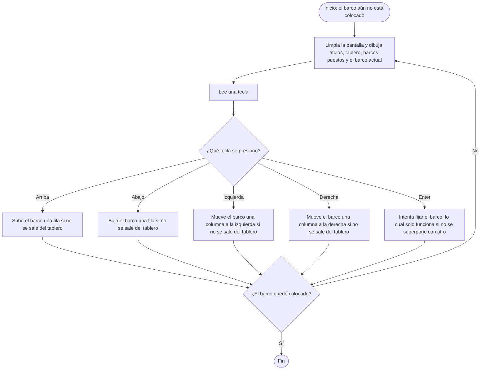
```mermaid
flowchart TD
A(["Inicio: el barco aún no está colocado"]) --> B["Limpia la pantalla y dibuja títulos, tablero, barcos puestos y el barco actual"]
B --> C["Lee una tecla"]
C --> D{"¿Qué tecla se presionó?"}
D -- "Arriba" --> D1["Sube el barco una fila si no se sale del tablero"]
D -- "Abajo" --> D2["Baja el barco una fila si no se sale del tablero"]
D -- "Izquierda" --> D3["Mueve el barco una columna a la izquierda si no se sale del tablero"]
D -- "Derecha" --> D4["Mueve el barco una columna a la derecha si no se sale del tablero"]
D -- "Enter" --> D5["Intenta fijar el barco, lo cual solo funciona si no se superpone con otro"]
D1 --> E{"¿El barco quedó colocado?"}
D2 --> E
D3 --> E
D4 --> E
D5 --> E
E -- "No" --> B
E -- "Sí" --> F(["Fin"])
```

#### `has_boats(int[][] board)`

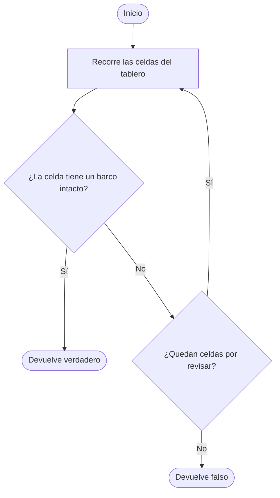
```mermaid
flowchart TD
A(["Inicio"]) --> B["Recorre las celdas del tablero"]
B --> C{"¿La celda tiene un barco intacto?"}
C -- "Sí" --> D(["Devuelve verdadero"])
C -- "No" --> E{"¿Quedan celdas por revisar?"}
E -- "Sí" --> B
E -- "No" --> F(["Devuelve falso"])
```

#### `reset_game(screen, player, bot)`

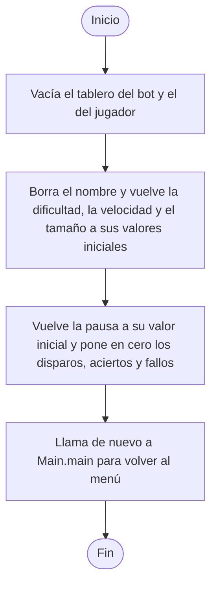
```mermaid
flowchart TD
A(["Inicio"]) --> B["Vacía el tablero del bot y el del jugador"]
B --> C["Borra el nombre y vuelve la dificultad, la velocidad y el tamaño a sus valores iniciales"]
C --> D["Vuelve la pausa a su valor inicial y pone en cero los disparos, aciertos y fallos"]
D --> E["Llama de nuevo a Main.main para volver al menú"]
E --> F(["Fin"])
```

#### `write(Path path, String content)`

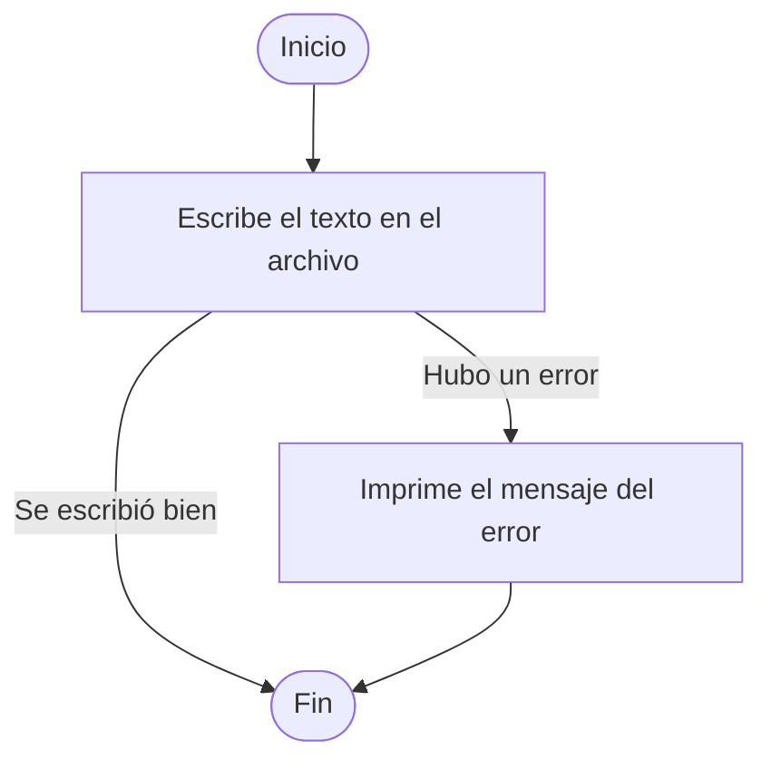
```mermaid
flowchart TD
A(["Inicio"]) --> B["Escribe el texto en el archivo"]
B -- "Se escribió bien" --> C(["Fin"])
B -- "Hubo un error" --> D["Imprime el mensaje del error"]
D --> C
```

#### `board_to_string(int[][] board, int size)`

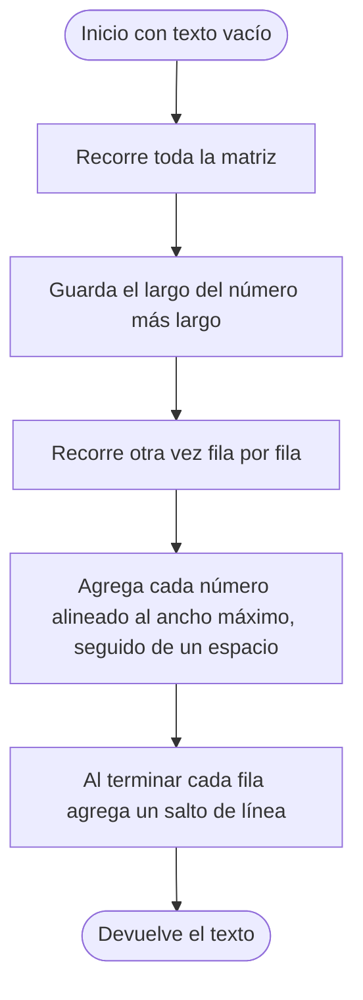
```mermaid
flowchart TD
A(["Inicio con texto vacío"]) --> B["Recorre toda la matriz"]
B --> C["Guarda el largo del número más largo"]
C --> D["Recorre otra vez fila por fila"]
D --> E["Agrega cada número alineado al ancho máximo, seguido de un espacio"]
E --> F["Al terminar cada fila agrega un salto de línea"]
F --> G(["Devuelve el texto"])
```

#### `save_game(bot_board, player_board, user, misses, acerts, size_board)`

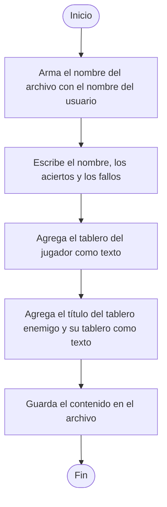
```mermaid
flowchart TD
A(["Inicio"]) --> B["Arma el nombre del archivo con el nombre del usuario"]
B --> C["Escribe el nombre, los aciertos y los fallos"]
C --> D["Agrega el tablero del jugador como texto"]
D --> E["Agrega el título del tablero enemigo y su tablero como texto"]
E --> F["Guarda el contenido en el archivo"]
F --> G(["Fin"])
```

### Clases auxiliares (Game.java)

#### `Board.set_board(int x, int y)`

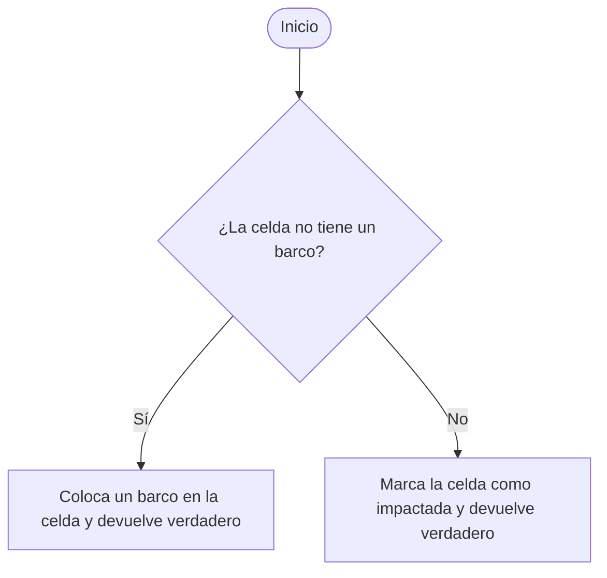
```mermaid
flowchart TD
A(["Inicio"]) --> B{"¿La celda no tiene un barco?"}
B -- "Sí" --> C["Coloca un barco en la celda y devuelve verdadero"]
B -- "No" --> D["Marca la celda como impactada y devuelve verdadero"]
```

#### `Boat.generate_boat(int size_boat)`

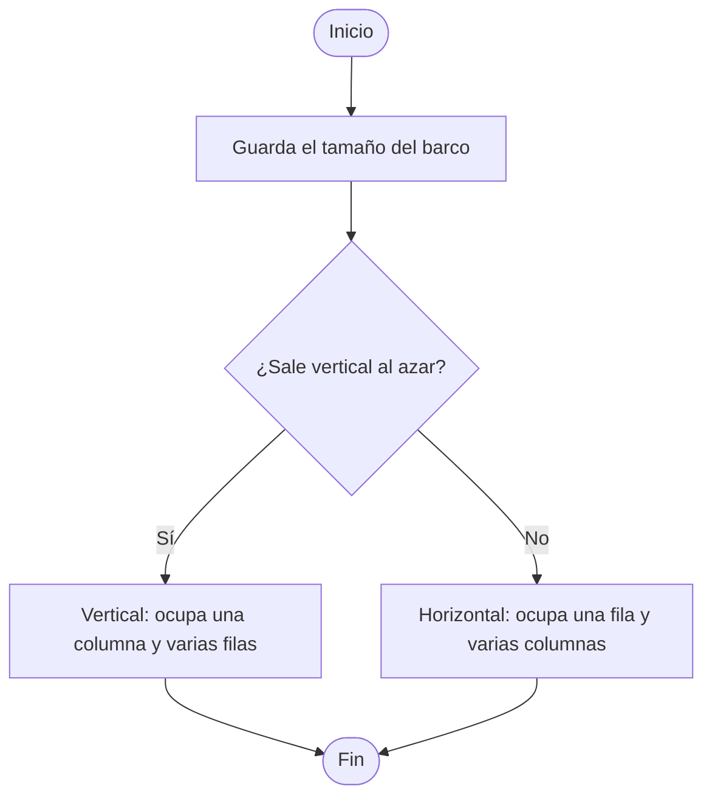
```mermaid
flowchart TD
A(["Inicio"]) --> B["Guarda el tamaño del barco"]
B --> C{"¿Sale vertical al azar?"}
C -- "Sí" --> D["Vertical: ocupa una columna y varias filas"]
C -- "No" --> E["Horizontal: ocupa una fila y varias columnas"]
D --> F(["Fin"])
E --> F
```

#### `Player.reset_board(size) y constructor Player(size)`

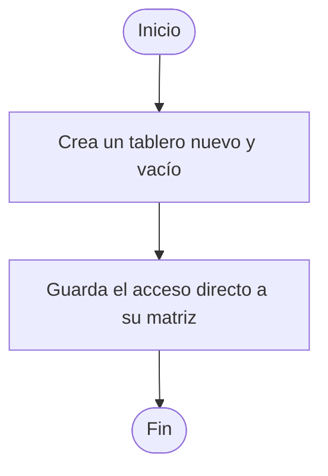
```mermaid
flowchart TD
A(["Inicio"]) --> B["Crea un tablero nuevo y vacío"]
B --> C["Guarda el acceso directo a su matriz"]
C --> D(["Fin"])
```

#### `Player.set_boat(min_x, max_x, min_y, max_y)`

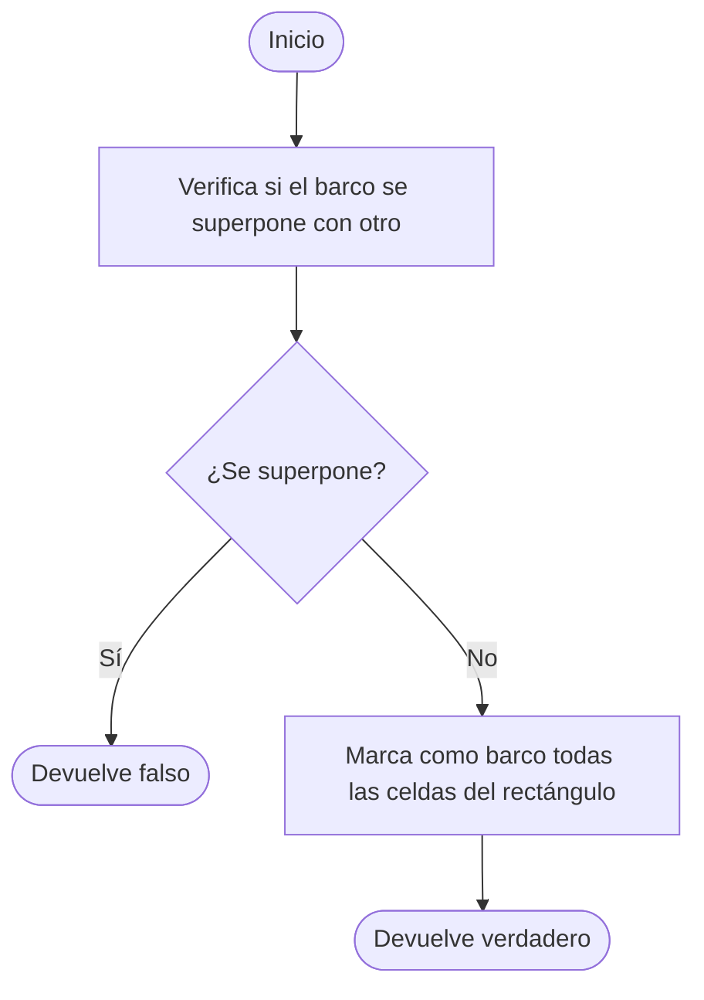
```mermaid
flowchart TD
A(["Inicio"]) --> B["Verifica si el barco se superpone con otro"]
B --> C{"¿Se superpone?"}
C -- "Sí" --> D(["Devuelve falso"])
C -- "No" --> E["Marca como barco todas las celdas del rectángulo"]
E --> F(["Devuelve verdadero"])
```

#### `Player.verifyi_boat_in(min_x, max_x, min_y, max_y)`

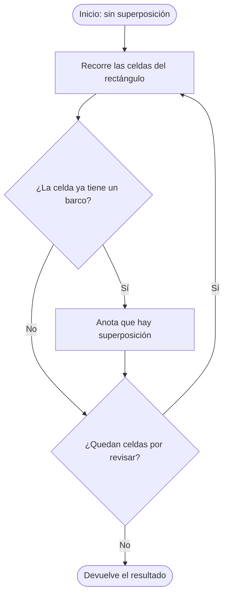
```mermaid
flowchart TD
A(["Inicio: sin superposición"]) --> B["Recorre las celdas del rectángulo"]
B --> C{"¿La celda ya tiene un barco?"}
C -- "Sí" --> D["Anota que hay superposición"]
C -- "No" --> E{"¿Quedan celdas por revisar?"}
D --> E
E -- "Sí" --> B
E -- "No" --> F(["Devuelve el resultado"])
```

#### `Player.set_boat_random_place(board, max_x, max_y, random, size_board)`

```mermaid
flowchart TD
A(["Inicio"]) --> B["Elige al azar una esquina que deje el barco dentro del tablero"]
B --> C["Revisa si toda el área del barco está libre"]
C --> D{"¿Alguna celda ya tiene un barco?"}
D -- "Sí" --> B
D -- "No" --> F["Marca como barco toda el área"]
F --> G(["Fin"])
```

### Bot.java

#### `Play(int[][] board, int size)`

```mermaid
flowchart TD
A(["Inicio: apunta a agua"]) --> B{"¿Un número al azar según la puntería indica apuntar a un barco?"}
B -- "Sí" --> C["Cambia el objetivo a barco"]
B -- "No" --> D["Cuenta las celdas del tipo objetivo"]
C --> D
D --> E{"¿No hay celdas de ese tipo?"}
E -- "Sí" --> F["Cambia al otro tipo de objetivo y vuelve a contar"]
E -- "No" --> G["Elige al azar cuál de esas celdas disparar"]
F --> G
G --> H["Recorre el tablero contando las celdas del tipo objetivo"]
H --> I{"¿Llegó a la celda elegida?"}
I -- "No" --> H
I -- "Sí" --> K["Dispara a esa celda"]
K --> L{"¿El objetivo era un barco?"}
L -- "Sí" --> R1(["Devuelve verdadero: acertó"])
L -- "No" --> R2(["Devuelve falso: falló"])
```

#### `count_cells(board, size, value)`

```mermaid
flowchart TD
A(["Inicio con contador en cero"]) --> B["Recorre las celdas del tablero"]
B --> C{"¿La celda tiene el valor buscado?"}
C -- "Sí" --> D["Suma uno al contador"]
C -- "No" --> E{"¿Quedan celdas por revisar?"}
D --> E
E -- "Sí" --> B
E -- "No" --> F(["Devuelve el contador"])
```

#### `shoot(board, x, y)`

```mermaid
flowchart TD
A(["Inicio"]) --> B{"¿La celda tiene un barco?"}
B -- "Sí" --> C["Marca la celda como impactada"]
B -- "No" --> D["Marca la celda como disparo fallado"]
C --> E(["Fin"])
D --> E
```

### Display.java

#### `sleep(int sleep)`

```mermaid
flowchart TD
A(["Inicio"]) --> B["Pausa el programa los milisegundos indicados"]
B -- "Terminó la pausa" --> C(["Fin"])
B -- "La pausa fue interrumpida" --> D["Restaura el estado de interrupción del hilo"]
D --> C
```

#### `center_x(total, width) y max_line_width(lines)`

Función `center_x`:

```mermaid
flowchart TD
A(["Inicio"]) --> B["Resta el ancho del elemento al ancho total"]
B --> C["Divide el resultado entre dos"]
C --> D(["Devuelve la columna inicial"])
```

Función `max_line_width`:

```mermaid
flowchart TD
A(["Inicio con máximo en cero"]) --> B["Toma la siguiente línea"]
B --> C{"¿Es más larga que el máximo actual?"}
C -- "Sí" --> D["Actualiza el máximo"]
C -- "No" --> E{"¿Quedan líneas?"}
D --> E
E -- "Sí" --> B
E -- "No" --> F(["Devuelve el máximo"])
```

#### `draw_box(txt, x, y, width, height, style)`

```mermaid
flowchart TD
A(["Inicio"]) --> B["Separa los seis caracteres del estilo del marco"]
B --> C["Dibuja los bordes horizontales de arriba y de abajo"]
C --> D["Dibuja los bordes verticales de izquierda y derecha"]
D --> E["Dibuja las cuatro esquinas"]
E --> F(["Fin"])
```

#### `draw_options(txt, options, selected, x, y, spacing)`

```mermaid
flowchart TD
A(["Inicio"]) --> B{"¿Quedan opciones por dibujar?"}
B -- "Sí" --> C{"¿Es la opción resaltada?"}
C -- "Sí" --> D["Usa fondo blanco y texto negro"]
C -- "No" --> E["Usa los colores por defecto"]
D --> F["Escribe la opción en su posición, separada por el espaciado"]
E --> F
F --> B
B -- "No" --> G["Restaura los colores"]
G --> H(["Fin"])
```

#### `draw_board(txt, x, y, size, board)`

```mermaid
flowchart TD
A(["Inicio con negrita activada"]) --> B["Toma la siguiente celda"]
B --> C{"¿Qué valor tiene la celda?"}
C -- "Impacto" --> D["Dibuja una x roja"]
C -- "Fallo" --> E["Dibuja un cero blanco"]
C -- "Agua o barco" --> F["Dibuja un cuadrado azul"]
D --> G["Restaura los colores"]
E --> G
F --> G
G --> H{"¿Quedan celdas?"}
H -- "Sí" --> B
H -- "No" --> I(["Fin"])
```

#### `draw_boats(txt, board, size, x, y)`

```mermaid
flowchart TD
A(["Inicio"]) --> B["Toma la siguiente celda"]
B --> C{"¿La celda tiene un barco intacto?"}
C -- "Sí" --> D["Dibuja un cuadrado rojo y restaura los colores"]
C -- "No" --> E{"¿Quedan celdas?"}
D --> E
E -- "Sí" --> B
E -- "No" --> F(["Fin"])
```

#### `draw_boats_and_pointer(txt, board, size, x, y, min_x, max_x, min_y, max_y)`

```mermaid
flowchart TD
A(["Inicio"]) --> B["Toma la siguiente celda"]
B --> C{"¿La celda tiene un barco ya colocado?"}
C -- "Sí" --> D["Dibuja un cuadrado rojo"]
C -- "No" --> E{"¿La celda pertenece al barco que se está colocando?"}
D --> E
E -- "Sí" --> F["Dibuja un cuadrado azul sobre fondo rojo"]
F --> G{"¿No es la primera columna del barco?"}
G -- "Sí" --> H["Rellena el espacio de la izquierda para que el barco se vea continuo"]
G -- "No" --> I["Restaura los colores"]
H --> I
E -- "No" --> J{"¿Quedan celdas?"}
I --> J
J -- "Sí" --> B
J -- "No" --> K(["Fin"])
```

#### `draw_pointer(mid, top, txt, x, y)`

```mermaid
flowchart TD
A(["Inicio"]) --> B["Elige azul sobre fondo rojo"]
B --> C["Dibuja un cuadrado en la celda del puntero"]
C --> D["Restaura los colores"]
D --> E(["Fin"])
```